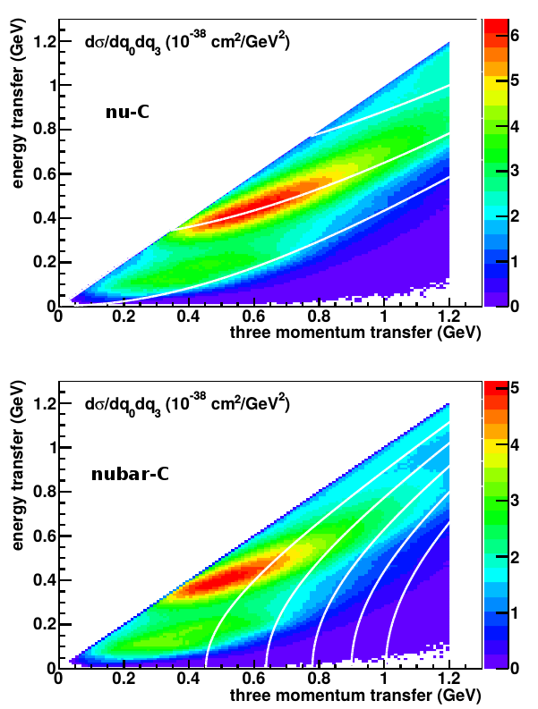
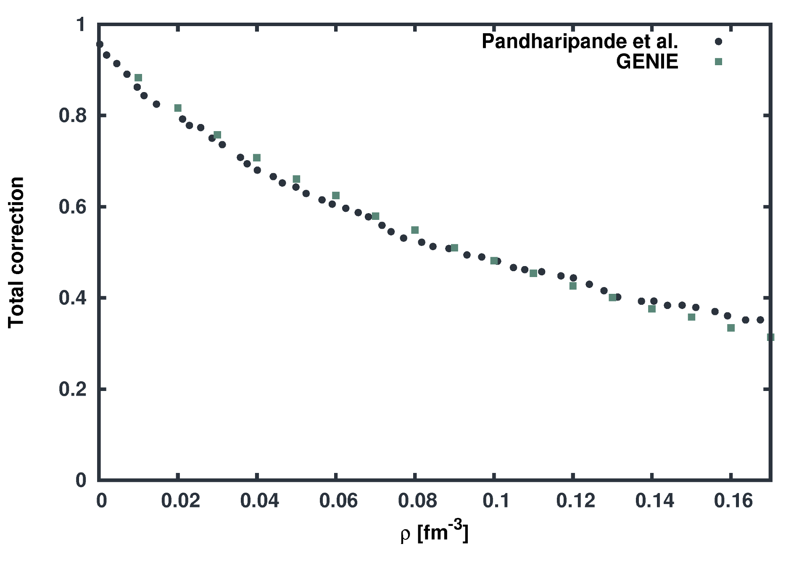
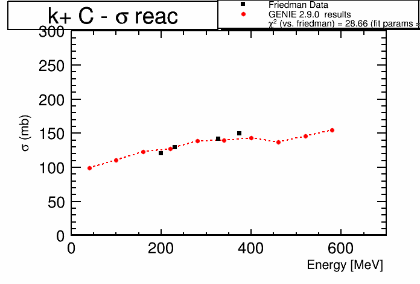
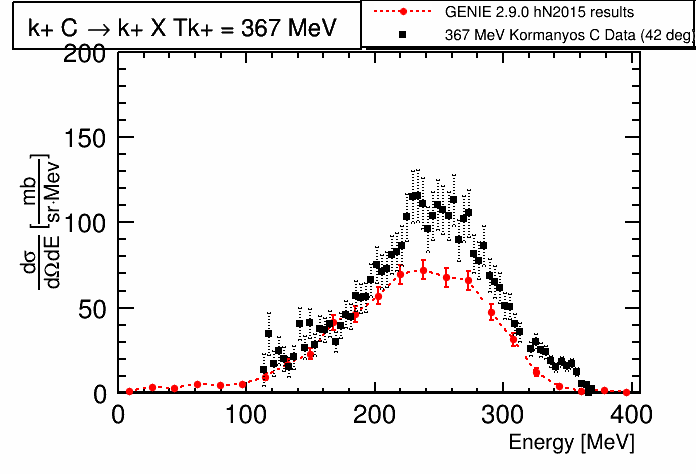
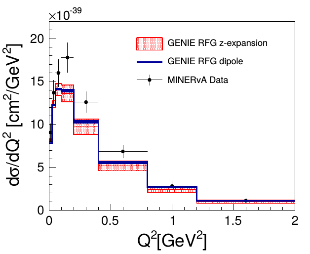

% GENIE Update
% Tomasz Golan
% *On behalf of Generator Group*     MINERvA Week June 2016

### On the last GENIE Update

---

* Effective spectral function by A. Bodek et al.
* Very high energy extension to 5 TeV
* Inclusive eta production
* Berger-Sehgal resonant pion model with MiniBooNE tuning
* Improved hA FSI model
* Single kaon production
* Flux driver updates
* GSL for all integration routines
* See [docdb-11836](http://minerva-docdb.fnal.gov:8080/cgi-bin/ShowDocument?docid=11836)

---

### What's new in GENIE 2.12

---

* One-body current QEL with LFG and RPA gas by Nieves et al.
* Two-body current interactions by Nieves et al
* hN FSI improvements
* Kaon FSI
* Resonance model update
* z-expansion
* Berger-Sehgal for COH

---

### QEL + RPA

---

 

The full description of QEL events is obtained by the inclusion of both:

* two-body current interactions (2p2h)

* random phase approximation (RPA)

*J. Nieves et al. [arXiv:1310.7091 [hep-ph]](http://arxiv.org/abs/1310.7091)*

---

### Two-body current interactions

---

* Interaction occurs on two correlated nucleons (SRC)

* No meson production

---

### hN2015 FSI

---

* pion-nucleon cross section based on Oset et al. model

    * absorption is introduced through the modification of $\Delta$ self-energy in nuclear matter

* the correction to nucleon-nucleon cross section is included

    * effective mass (potential) changes free xsec in nuclear matter

 

---

### Kaon FSI

---

* charge exchange added
* absorption improved

*mentioned updates, only for hA*

---

### Resonance model

---

* $\Delta \rightarrow \pi N$ angular distribution (based on Rein-Sehgal)

* $\Delta \rightarrow N \gamma$ improved kinematics and W dependence (based on MB)

---

### z-expansion

---

 

* Parametrization of form factors:

$$F_A(q^2) = \sum\limits_{k=0}^{k_{max}} a_k z(q^2)^k$$
$$z(q^2, t_{cut}, t_0) = $$
$$\frac{\sqrt{t_{cut} - q^2} - \sqrt{t_{cut} - t_0}}{\sqrt{t_{cut} - q^2} + \sqrt{t_{cut} - t_0}}$$

where $t$, $a_k$ are arbitrary numbers

*A. Meyer et al. [arXiv:1603.03048 [hep-ph]](http://arxiv.org/abs/1603.03048)*

---

### Coherent pion production

---

Berger-Sehgal for CC/NC coherent pion production

---

# THE END
