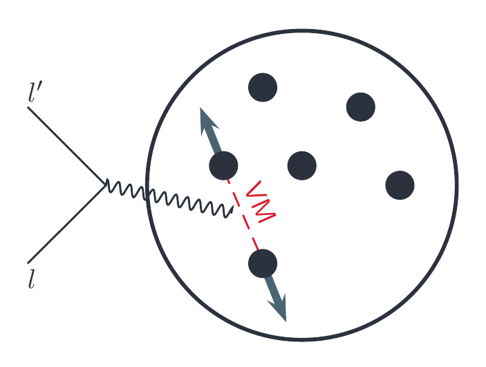

% NuWro CCQE samples
% Tomasz Golan
% CCQE meeting, 05.10.2016

## Why this talk?

---

* Some NuWro samples were produced.
* More NuWro samples will be produced.
* What samples?
* Where do they live?
* How to use them?

---

#

## Location

---

```cpp
/minerva/data/users/goran/nuwro_ccqe_samples/
├── dist                                                            | extracted histograms
│   ├── minerva_fhcnue_cc_ch_lfg_norpa_tem_ma099_histograms.root
│   ├── minerva_fhcnue_cc_ch_rfg_norpa_nieves_ma099_histograms.root
│   ├── ...
│   ├── minerva_fhcnue_cc_ch_rfg_rpa_tem_ma099_histograms.root
│   └── minerva_fhcnue_cc_ch_sf_norpa_nomec_ma099_histograms.root
├── nuwro_ccqe_extractor.c                                          | ROOT macro
└── root                                                            | simulation outputs
    ├── minerva_fhcnue_cc_ch_lfg_norpa_tem_ma099.root               | event tree
    ├── minerva_fhcnue_cc_ch_lfg_norpa_tem_ma099.root.par           | parameters
    ├── minerva_fhcnue_cc_ch_lfg_norpa_tem_ma099.root.txt           | total cross section
    ├── ...
    ├── minerva_fhcnue_cc_ch_sf_norpa_nomec_ma099.root
    ├── minerva_fhcnue_cc_ch_sf_norpa_nomec_ma099.root.par
    └── minerva_fhcnue_cc_ch_sf_norpa_nomec_ma099.root.txt
```

---

## Naming convention

---

```cpp
minerva_[beam]_[current]_[target]_[nucleus]_[rpa]_[npnh]_[axial mass]

[beam]       = fhcnue / rhcnue      | neutrino / anti-neutrino with nu-e constraint
[current]    = cc / nc              | charged / neutral current
[target]     = ch                   | CH
[nucleus]    = rfg / lfg / sf       | global / local Fermi gas / spectral function
[rpa]        = rpa / norpa          | random phase approximation
[npnh]       = nomec / tem / nieves | no npnh / transverse enhancement / Nieves et al
[axial_mass] = maXXX                | XXX = axial mass in GeV
```

---

## Some common parameters

---

<div class='left' style="margin-bottom: 20px;">
```
number_of_events = 10000000

nucleus_E_b =  25
nucleus_kf  = 221

dyn_qel_cc = 1
dyn_res_cc = 1
dyn_dis_cc = 1
```
</div>
<div class='right'>
```
dyn_qel_nc = 0
dyn_res_nc = 0
dyn_dis_nc = 0
dyn_coh_cc = 0
dyn_coh_nc = 0

// BBBA05, hep-ex/0602017
qel_vector_ff_set = 2
```
</div>

---

#

## Models

## Fermi gas

---

<div class='left'>
Nucleons move freely within the nuclear volume in constant binding potential.

---

<br>

* RFG:     $p_F = \frac{\hbar}{r_0}\left(\frac{9\pi N}{4A}\right)^{1/3}$

* LFG:     $p_F(r) = \hbar\left(3\pi^2\rho(r) \frac{N}{A}\right)^{1/3}$

</div>
<div class='right'>


</div>

---

## Spectral function

---

<div class='left'>

The probability of removing a nucleon with momentum $\vec p$ and leaving
residual nucleus with excitation energy $E$:

$$P(\vec p, E) = P_{MF}(\vec p, E) + P_{SRC}(\vec p, E)$$

---


</div>
<div class='right'>


</div>

---

## Two-body current

---

<div class='left' style="margin-bottom: 40px;">

* Nieves - microscopic calculations
* TEM - modification of the vector magnetic form factors
* Both:
    * Inclusive double differential xsec for the final state lepton
    * Final nucleons momenta are set isotropically in CMS

</div>
<br>


---

## TEM vs Nieves

---


---

## TEM vs Nieves: kinematics

---


---

#

## NuWro CCQE Extractor

## Setup

---

* To run `nuwro_ccqe_extractor` one needs ROOT with NuWro dictionary
* You can use my setups:

```
alias setup_root='source /minerva/app/users/goran/GENIE/environment_genie.sh'

alias myroot='/minerva/app/users/goran/nuwro_533497d/bin/myroot'
```

---

## Main function

---

<pre><code class="cpp">void nuwro_ccqe_extractor(char *filename)

* assuming filename w/o .root extension
* assuming file in pwd/root folder
* saves output in pwd/dist folder
</code></pre>

---

<h3> Example </h3>

---

<pre><code class="bash">$ cd /minerva/data/users/goran/nuwro_ccqe_samples/
$ source /minerva/app/users/goran/GENIE/environment_genie.sh
$ /minerva/app/users/goran/nuwro_533497d/bin/myroot
root [0] .L nuwro_ccqe_extractor.c
root [1] nuwro_ccqe_extractor("minerva_fhcnue_cc_ch_sf_norpa_tem_ma099")
</code></pre>

---

## Main loop

---

```
for (unsigned int i = 0; i < nof_events; i++)
{
    tree->GetEntry(i);

    const double Q2 = -e->q2() / 1000000.0;     // in GeV^2
    const double pl = e->out[0].p().z / 1000.0; // in GeV
    const double pt = sqrt(e->out[0].p().x * e->out[0].p().x
                           + e->out[0].p().y * e->out[0].p().y) / 1000.0;

    .
    .
    .

    if (100 * i % nof_events == 0)
      cout << 100 * i / nof_events << "%     \r" << flush;
}
```

---

## Signal selection

---

<pre><code class="cpp">    if (is_ccqe_true(e))
    {
        q2_true_nocut->Fill(Q2);
        ptpl_true_nocut->Fill(pt, pl);

        if (angle_cut(e))
        {
            q2_true_cut->Fill(Q2);
            ptpl_true_cut->Fill(pt, pl);
        }
    }

    if (is_ccqe_like(e))
    {
      ...
    }
</code></pre>

---

## Example signal definition

---

<pre><code class="cpp">// check if the event is ccqe-like
bool is_ccqe_like(event *e, const double Tk_cut = 120.0)
{
    // XYZ -> no. of pi+ (X), pi- (Y), pi0 (Z) in the final state
    int pion_code = 100.0 * e->fof(211) + 10.0 * e->fof(-211) + e->fof(111);
    // not ccqe-like if at least one pion
    if (pion_code) return false;
    // no proton cut for neutirno
    if (e->in[0].pdg == 14) return true;
    // check protons Tk for anti-neutrino
    for (unsigned int i = 0; i < e->post.size(); i++)
          if (e->post[i].pdg == 2212 && e->post[i].Ek() > Tk_cut) return false;

    return true;
}
</code></pre>

---

## Binning

---

```
const double q2_bins[] = {0, 0.025, 0.05, 0.1, 0.2, 0.4, 0.8, 1.2, 2.0};
const double pt_bins[] = {0, 0.15, 0.25, 0.4, 0.7, 1.0, 1.5};
const double pl_bins[] = {1.5, 2.0, 2.5, 3.0, 3.5, 4.0, 4.5, 5.0, 6.0, 8.0, 10.0, 15.0};
```
---

Read more on using NuWro: [NuWro HowTo](https://cdcvs.fnal.gov/redmine/attachments/download/26099/nuwro_howto.pdf)

---
