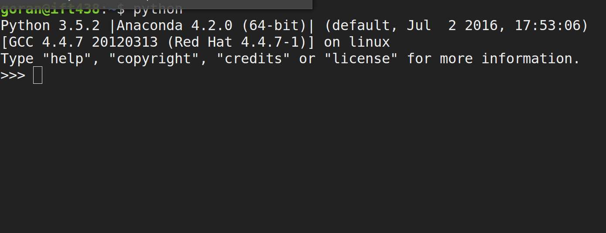
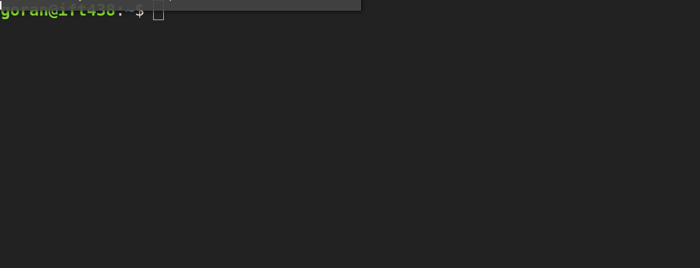

% Języki skryptowe - Python
% Wykład 13
% Powtórka cz. I

<div class='footer'>
Navigate:
<br> &emsp; PgDn / PgUp - next / previous slide
<br> &emsp; Esc - expo mode
</div>

#

## Plan wykładu

---

* [Wprowadzenie](#tryb-interaktywny)
* [Typy danych](#typy-danych)
* [Instrukcje sterujące](#instrukcja-warunkowa-if)
* [Funkcje](#funkcje)

#

## Tryb interaktywny

---


## Tryb interaktywny

---

<div class="left">
```py
# my_math.py
"""Zbiór funkcji matematycznych"""


def delta(a, b, c):
    """Wyróżnik trójmianu kwadratowego"""
    return b*b - 4*a*c

if __name__ == "__main__":
    a = eval(input("a = "))
    b = eval(input("b = "))
    c = eval(input("c = "))
    print("Delta =", delta(a, b, c))
```
</div>
<div class="right"><br>

</div>

## Tryb interaktywny

---

<div class="left">
```py
# my_math.py
"""Zbiór funkcji matematycznych"""


def delta(a, b, c):
    """Wyróżnik trójmianu kwadratowego"""
    return b*b - 4*a*c

if __name__ == "__main__":
    a = eval(input("a = "))
    b = eval(input("b = "))
    c = eval(input("c = "))
    print("Delta =", delta(a, b, c))
```
</div>
<div class="right"><br>

</div>

## Tryb skryptowy

---

<div class="left">
```py
# my_math.py
"""Zbiór funkcji matematycznych"""


def delta(a, b, c):
    """Wyróżnik trójmianu kwadratowego"""
    return b*b - 4*a*c

if __name__ == "__main__":
    a = eval(input("a = "))
    b = eval(input("b = "))
    c = eval(input("c = "))
    print("Delta =", delta(a, b, c))
```
</div>
<div class="right"><br>

</div>

## Typowanie dynamiczne

---

<div class="left">

* przypisywanie typów w trakcie działania programu

* jedna zmienna może przechowywać różne typy

* zaleta: wygoda

* wada: kontrola

</div>
<div class="right"><br>

</div>

#

## Typy danych

---

<div class="left"><br>

* liczby: <font color="red">int</font>, <font color="red">float</font>, <font color="red">complex</font>

* sekwencje: <font color="green">list</font>, <font color="red">tuple</font>, <font color="red">range</font>, <font color="red">str</font>

* zbiory: <font color="green">set</font>, <font color="red">frozenset</font>

* mapujące: <font color="green">dict</font>

*<font color="red">typy niemutujące</font><br><font color="green">typy mutujące</font>*
</div>
<div class="right"><br>

```py
>>> x = [1, 2, 3]
>>> y = x
>>> y.append(4)
>>> x
[1, 2, 3, 4]
# y.append zmieniło x
# bo zmienne x i y wskazują
# na ten sam obiekt
>>> id(x)
140462289826888
>>> id(y)
140462289826888
# list.copy tworzy kopię
>>> z = x.copy()
>>> id(z)
140462289924616
```

</div>

## Typy sekwencyjne - indeksowanie

---

<div class="left"><br>

* indeksowanie od $0$ do $N-1$

* ujemny indeks - liczymy od końca

* wycinki `[poczatek:koniec]` lub `[poczatek:koniec:krok]`

</div>
<div class="right"><br>

```py
>>> x = [1, 2, 3, 4, 5] # tworzymy listę
>>> x[1] # indeks 1 -> drugi element
2
>>> x[-1] # indeks -1 -> ostatni element
5
>>> x[1::2] # od drugiego do końca co dwa
[2, 4]
# indeks 5 wychodzi poza zasięg
# bo od 0 do 4
>>> x[5]
Traceback (most recent call last):
  File "<stdin>", line 1, in <module>
IndexError: list index out of range
>>>
```
</div>

## Operacje na sekwencjach

---

<div class="left"><br>

* operator `in` sprawdza, czy element znajduje się w danej sekwencji

* operator `+` dodaje do siebie dwie sekwencje tego samego typu

* operator `del` usuwa wycinek listy

</div>
<div class="right"><br><br>

```py
>>> x = [1, 2, 3] + [4, 5]
>>> x
[1, 2, 3, 4, 5]
>>> 5 in x # 5 jest na liście
True
>>> del x[-1] # usuwamy ostatni element
>>> 5 in x # 5 nie ma na liście
False
```
</div>

## Funkcje wbudowane

---

<div class="left"><br>

* *len* zwraca długość sekwencji

* *min* zwraca najmniejszy element

* *max* zwraca największy element

</div>
<div class="right"><br><br>

```py
>>> x = (1, 2, 3, 4, 5) # krotka
>>> len(x) # długość krotki
5
>>> min(x) # minimum
1
>>> max(x) # maksimum
5
```
</div>

## Zbiory

---

<div class="left"><br>

* zbiór (*set*) nie może zawierać duplikatów

* jest nieuporządkowany

* *frozenset* nie można modyfikować

</div>
<div class="right"><br>

```py
>>> x = {1, 2, 3, 1, 2, 4} # set
>>> x # duplikaty automatycznie usunięte
{1, 2, 3, 4}
>>> x.add(5) # dodajemy 5
>>> x
{1, 2, 3, 4, 5}
>>> x.add(5) # nic się nie dzieje
>>> x
{1, 2, 3, 4, 5}
>>> frozen = frozenset(x) # nietykalny zbiór
>>> frozen.add(5) # nie można modyfikować
Traceback (most recent call last):
  File "<stdin>", line 1, in <module>
  AttributeError: 'frozenset' object has
  no attribute 'add'
```
</div>

## Zbiory - przykład

---

<div class="left">

```py
# lista_zakupow.py
"""System zarządzania listą zakupów."""


def dodaj(produkt, lista):
    """Dodaje produkt do listy zakupów."""
    print("Dodaję:", produkt)
    lista.add(produkt)
    print("Lista:", lista)


def usun(produkt, lista):
    """Usuwa produkt z listy zakupów."""
    print("Usuwam:", produkt)
    lista.discard(produkt)
    print("Lista:", lista)

if __name__ == "__main__":
    zakupy = set()  # moja lista zakupów
    dodaj("jajka", zakupy)
    dodaj("masło", zakupy)
    dodaj("jajka", zakupy)
    dodaj("chleb", zakupy)
    usun("masło", zakupy)
```
</div>
<div class="right"><br>
```
goran@ift438:~$ python lista_zakupow.py
Dodaję: jajka
Lista: {'jajka'} # jajka dodane
Dodaję: masło
Lista: {'jajka', 'masło'} # masło dodane
Dodaję: jajka
Lista: {'jajka', 'masło'} # jajka już są
Dodaję: chleb
Lista: {'jajka', 'chleb', 'masło'} # +chleb
Usuwam: masło
Lista: {'jajka', 'chleb'} # masło usunięte
```
</div>

## Część wspólna zbiorów

---

<div class="left"><br>

* *set.intersection* zwraca część wspólną zbiorów

* lub można skorzystać z operatora `&`

</div>
<div class="right"><br>
```py
>>> x = {1, 2, 3, 4}
>>> y = {1, 5, 2, 8}
>>> x.intersection(y)
{1, 2}
>>> x & y # intersection
{1, 2}
```
</div>

## Część wspólna - przykład

---

<div class="left"><br>

```py
# przedmioty.py

with open("fk.txt") as f:
    fk = f.read().splitlines()

with open("issp.txt") as f:
    issp = f.read().splitlines()

common = list(set(issp) & set(fk))

print("Wspólne przedmioty:", common)
```

</div>
<div class="right"><br>
```
# zawartość pliku fk.txt
goran@ift438:~$ cat fk.txt
fizyka
matematyka
python
# zawartość pliku issp.txt
goran@ift438:~$ cat issp.txt
c++
python
matematyka
# uruchamiamy przedmioty.py
goran@ift438:~$ python przedmioty.py
Wspólne przedmioty: ['python', 'matematyka']
```
</div>

## Słowniki

---

<div class="left">

* słowniki (*dict*) mapują *klucze* na *wartości*

* nie są uporządkowane

* *slownik[klucz]* zwraca odpowiednią wartość

* *slownik.get(klucz)* zwraca wartość lub *NULL* jeśli klucz nie istnieje

</div>
<div class="right"><br>

```py
>>> x = {"jeden": 1, "dwa": 2}
>>> x["jeden"] # wartość dla klucza "jeden"
1
>>> x.get("dwa") # wartość dla klucza "dwa"
2
>>> x["trzy"] # nie ma "trzy" -> błąd
Traceback (most recent call last):
  File "<stdin>", line 1, in <module>
KeyError: 'trzy'
>>> x.get("trzy") # nie ma "trzy" -> NULL
>>> zmienna = x.get("trzy") or 3 # NULL or 3
>>> zmienna
3
```

</div>

## Słowniki przykład

---

<div class="left"><br>

```py
# ewidencja.py
"""Ewidencja pojazdów"""

indeks = 0  # id pojazdu
pojazdy = {}


def dodaj(nazwa):
    """Dodaje pojazd i generuje nowe id."""
    global indeks  # użyj globalnej zmiennej
    global pojazdy

    pojazdy[nazwa] = indeks  # dodaj pojazd

    indeks += 1  # zwieksz id

if __name__ == "__main__":
    dodaj("maluch")
    dodaj("polonez")
    dodaj("ford mustang")

    for car, index in pojazdy.items():
        print(index, car)
```

</div>
<div class="right"><br><br><br>

```
goran@ift438:~$ python ewidencja.py
0 maluch
1 polonez
2 ford mustang
```

</div>

#

## Instrukcja warunkowa *if*

---

<div class="left"><br>

* instrukcja warunkowa *if* umożliwia wykonanie bloku instrukcji gdy spełnione jest zadane wyrażenie logiczne

</div>
<div class="right"><br>

```py
if wyrażenie:
  instrukcja
elif inne_wyrażenie:
  jakaś inna instrukcja
else:
  jeszcze inna instrukcja
```

</div>

## *if* - przykład

---

<div class="left"><br>

```py
# imie.py
"""Sprawdza, czy podane imię
jest męskie czy żeńskie.
"""

# pobiera imię od użytkownika
imie = input("Podaj swoje imię: ")

if imie[-1] == 'a':  # jeśli kończy się na a
    print("Jesteś kobietą.")
else:  # jeśli nie kończy się na a
    print("Nie jesteś kobietą.")
```

</div>
<div class="right"><br>

```
goran@ift438:~$ python imie.py
Podaj swoje imię: Tomasz
Nie jesteś kobietą.
goran@ift438:~$ python imie.py
Podaj swoje imię: Katarzyna
Jesteś kobietą.
goran@ift438:~$ python imie.py
Podaj swoje imię: Barnaba
Jesteś kobietą.
```

</div>

## *if elif* - przykład

---

<div class="left"><br>

```py
# usa.py
"""Prawa obywatela USA."""

# pobiera wiek (input)
# zamienia na liczbę (eval)
wiek = eval(input("Podaj wiek: "))

if wiek < 18:
    print("Jesteś nieletni.")
elif wiek < 21:
    print("Możesz głosować, "
          "ale piwa się nie napijesz.")
else:
    print("Możesz wszystko.")
```

</div>
<div class="right"><br>

```
goran@ift438:~$ python usa.py
Podaj wiek: 12
Jesteś nieletni.
goran@ift438:~$ python usa.py
Podaj wiek: 20
Możesz głosować, ale piwa się nie napijesz.
goran@ift438:~$ python usa.py
Podaj wiek: 30
Możesz wszystko.
```

</div>

## Pętla *for*

---

<div class="left"><br>

* pętla po sekwencji

* pętla po dowolnym obiekcie, który jest iterowalny

</div>
<div class="right"><br><br>

```py
for zmienna in sekwencja:
  instrukcja
```

</div>

## Pętla po *range*

---

<div class="left"><br>

```py
# range.py
"""Pętle po range"""

print("range(10):", end=' ')

for liczba in range(10):
    print(liczba, end=' ')

print("\nrange(3, 10):", end=' ')

for liczba in range(3, 10):
    print(liczba, end=' ')

print("\nrange(3, 10, 2):", end=' ')

for liczba in range(3, 10, 2):
    print(liczba, end=' ')
```

</div>
<div class="right"><br>

```
goran@ift438:~$ python range.py
range(10): 0 1 2 3 4 5 6 7 8 9
range(3, 10): 3 4 5 6 7 8 9
range(3, 10, 2): 3 5 7 9
```

* *range(początek, koniec, krok)* zadaje ciąg liczb od początku do końca z zadanym kroku
* domyślnie początek = 0, a krok = 1

</div>

## Kolokwium - zadanie 1

---

Niech `poczatek` i `koniec` będą całkowitymi zmiennymi globalnymi. Napisz pętlę `for`, która drukuje na ekranie liczby całkowite ze zbioru `[poczatek, koniec]`.

<div class="left"><br>

```py
# zad1.py

poczatek = 10
koniec = 20

for x in range(poczatek, koniec+1):
    print(x, end=' ')
```

</div>
<div class="right"><br>

```
goran@ift438:~$ python zad1.py
10 11 12 13 14 15 16 17 18 19 20
```

</div>

## Pętla po liście / krotce

---

<div class="left"><br>

```py
# for.py
"""Pętle po liście i krotce."""


lista = ["jeden", "dwa", "trzy", "cztery"]
krotka = ("pięć", "sześć", 7, 8)

# pętla po liście
for element in lista:
    print(element, end=' ')

# pętla po krotce
for element in krotka:
    print(element, end=' ')
```

</div>
<div class="right"><br>

```
goran@ift438:~$ python for.py
jeden dwa trzy cztery pięć sześć 7 8
```

<br>

* krotka przechowuje dane różnych typów, ale to w niczym nie przeszkadza

</div>

## Lista z listy w pętli

---

<div class="left"><br>

```py
# list.py
"""Tworzy listę z listy w pętli."""

words = ["jeden", "dwa", "trzy"]
lengths = []

# zapisz długość każdego słowa na liście
for word in words:
    lengths.append(len(word))

# drukowanie "równoległe"
for i in range(len(words)):
    print("{} ma długość {}"
          .format(words[i], lengths[i]))
```

</div>
<div class="right"><br>

```
goran@ift438:~$ python list.py
jeden ma długość 5
dwa ma długość 3
trzy ma długość 4
```

<br>

* w tej sytuacji *append* nie jest efektywnym rozwiązaniem

</div>

## Lista składana

---

<div class="left"><br>

```py
# list.py
"""Tworzy listę z listy w pętli."""

words = ["jeden", "dwa", "trzy"]
lengths = [len(w) for w in words]

# drukowanie "równoległe"
for i in range(len(words)):
    print("{} ma długość {}"
          .format(words[i], lengths[i]))
```

</div>
<div class="right"><br>

```
goran@ift438:~$ python list.py
jeden ma długość 5
dwa ma długość 3
trzy ma długość 4
```

<br>

* już lepiej, ale *range* jest trochę nieeleganckie

</div>

## Pakowanie

---

<div class="left"><br>

```py
# list.py
"""Tworzy listę z listy w pętli."""

words = ["jeden", "dwa", "trzy"]
lengths = [len(w) for w in words]

# drukowanie "równoległe"
for w, l in zip(words, lengths):
    print("{} ma długość {}".format(w, l))
```

</div>
<div class="right"><br>

```
goran@ift438:~$ python list.py
jeden ma długość 5
dwa ma długość 3
trzy ma długość 4
```

<br>

* *zip* tworzy pary (word, length)

</div>

## Pętla *for* po słowniku

---

<div class="left"><br>

* *dict.keys()* zwraca klucze

* *dict.values()* zwraca wartości

* *dict.items()* zwraca pary (klucz, wartość)

</div>
<div class="right"><br>

```py
>>> x = {"jeden": 1, "dwa": 2, "trzy": 3}
>>> for key in x.keys(): print(key)
...
trzy
dwa
jeden
>>> for value in x.values(): print(value)
...
3
2
1
>>> for key, value in x.items(): print(key, value)
...
trzy 3
dwa 2
jeden 1
```

</div>

## Pętla po słowniku - przykład

---

<div class="left"><br>

```py
# dict.py
"""Wczytuje słownik z pliku i go drukuje."""


def wczytaj(plik):
    """Wczytuje słownik z pliku."""
    slownik = {}

    with open(plik) as f:
        for line in f:
            key, value = \
                line.strip('\n').split(' ')
            slownik[key] = value

    return slownik


def drukuj(slownik):
    """Drukuje słownik."""
    for k, v in slownik.items():
        print(k, v)

if __name__ == "__main__":
    slownik = wczytaj("slownik.txt")
    drukuj(slownik)
```

</div>
<div class="right"><br>

```
goran@ift438:~$ cat slownik.txt
klucz1 wartość1
klucz2 wartość2
klucz3 wartość3
goran@ift438:~$ python dict.py
klucz2 wartość2
klucz3 wartość3
klucz1 wartość1
```

</div>

## Pętla *while*

---

<div class="left"><br>

* pętla *while* wykonywana jest dopóki spełniony jest zadany warunek

* trzeba uważać na pętle nieskończone

</div>
<div class="right"><br><br>

```py
while warunek:
  instrukcja
```

</div>

## Kolokwium - zadanie 2

---

Niech `poczatek` i `koniec` będą całkowitymi zmiennymi globalnymi. Napisz pętlę `while`, która drukuje na ekranie liczby całkowite ze zbioru `[poczatek, koniec]`.

<div class="left"><br>

```py
# zad2.py

poczatek = 10
koniec = 20

while poczatek <= koniec:
    print(poczatek, end=' ')
    poczatek += 1

```

</div>
<div class="right"><br>

```
goran@ift438:~$ python zad2.py
10 11 12 13 14 15 16 17 18 19 20
```

</div>

## *while* - przykład

---

<div class="left"><br>

```py
# password.py
"""Pobieraj do skutku."""


def check(word, l=10):
    """Sprawdza, czy podane słowo
    posiada odpowednią długość"""
    return len(word) >= l

if __name__ == "__main__":
    while not check(input("Podaj hasło: ")):
        print("Hasło musi posiadać "
              "co najmniej 10 znaków.")
```

</div>
<div class="right"><br>

```
goran@ift438:~$ python password.py
Podaj hasło: 1234
Hasło musi posiadać co najmniej 10 znaków.
Podaj hasło: 1234567  
Hasło musi posiadać co najmniej 10 znaków.
Podaj hasło: 1234567890
goran@ift438:~$
```

</div>

#

## Funkcje

---

<div class="left"><br>

* funkcje to "wywoływalne bloki instrukcji"

* mogą przyjmować argumenty

* mogą zwracać obiekty

</div>
<div class="right"><br><br>

```py
def nazwa_funkcji (argumenty):
  instrukcje
```

</div>

## Funkcje - przykład

---

<div class="left"><br>

```py
# funkcje.py
"""Przykłady funkcji"""


def arg0():
    print("Nie przyjmuję argumentów.")


def arg1(x):
    print("Przyjmuję jeden argument:", x)


def arg1d(x=1):
    print("Mam arg z wart. domyślną:", x)

if __name__ == "__main__":
    arg0()
    arg1(5)
    arg1d(10)
    arg1d()
```

</div>
<div class="right"><br><br>

```
goran@ift438:~$ python funkcje.py
Nie przyjmuję argumentów.
Przyjmuję jeden argument: 5
Mam arg z wart. domyślną: 10
Mam arg z wart. domyślną: 1
```

</div>

## Kolokwium - zadanie 3

---

Napisz funkcję, która liczy objętość prostopadłościanu. Funkcja powinna przyjmować trzy argumenty, które są długościami krawędzi. Wywołana z jednym argumentem powinna się domyślić, że chodzi o sześcian.

<div class="left"><br>

```py
# zad3.py


def vol(a, b=0, c=0):
    return a*b*c or a**3

print(vol(2))
print(vol(2, 3, 2))
```

</div>
<div class="right"><br><br>

```
goran@ift438:~$ python zad3.py
8
12
```

</div>

## Atrybuty funkcji

---

<div class="left"><br>

```py
# static.py


def funkcja():
    """Zlicza ilość wywołań."""
    funkcja.counter += 1
    print("Wywołana {} razy.".
          format(funkcja.counter))

funkcja.counter = 0  # wartość początkowa

for _ in range(10):
    funkcja()
```

</div>
<div class="right"><br><br>

```
goran@ift438:~$ python static.py
Wywołana 1 razy.
Wywołana 2 razy.
Wywołana 3 razy.
Wywołana 4 razy.
Wywołana 5 razy.
Wywołana 6 razy.
Wywołana 7 razy.
Wywołana 8 razy.
Wywołana 9 razy.
Wywołana 10 razy.
```

</div>

## Kolokwium - zadanie 4

---

Napisz skrypt, który pobiera od użytkownika dowolny tekst, a następnie drukuje na ekranie liczbę występujących w nim samogłosek.

<div class="left"><br>

```py
# zad4.py

def count(text):
    """Zlicza ilość samogłosek."""
    counter = 0

    for letter in text.lower():
        counter += letter in count.vowels

    return counter

count.vowels = 'eyuioa'

if __name__ == "__main__":
    text = input("Wprowadź tekst: ")
    print("#samogłosek =", count(text))
```

</div>
<div class="right"><br><br>

```
goran@ift438:~$ python zad4.py
Wprowadź tekst: Ala ma kota
#samogłosek = 5
```

</div>
