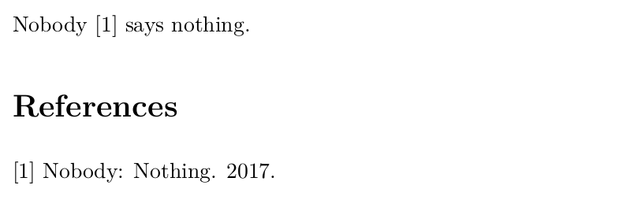
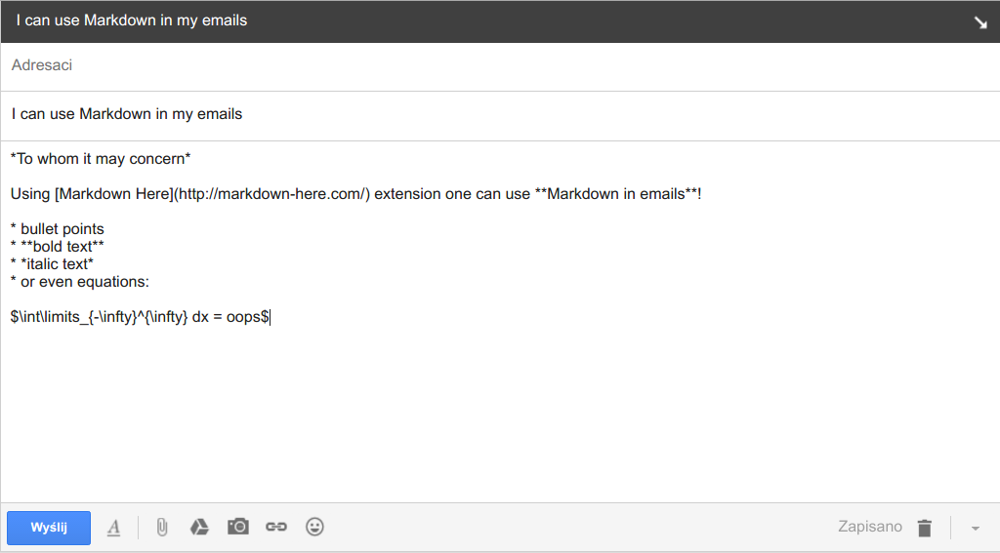

% Markdown, Pandoc,
% and other tools for lazy people
% Tomasz Golan @ Neutrino Seminar

<div class='footer'>
Navigate:
<br> &emsp; PgDn / PgUp - next / previous slide
<br> &emsp; Esc - expo mode
</div>

# 

## Outline

---

<br>

1. [Markdown basics](#markdown)

1. [Pandoc](#pandoc)

1. [Web page](#web-page-src)

1. [Presentation](#presentation-src)

1. [Publication](#publication-src)

1. [Extras](#markdown-to-slides)

#

## Markdown

---

<br>

* lightweight markup language

* designed for HTML

* possible to generate many other formats: LaTeX, pdf, Beamer...

## Markdown - headers

---

<div class=left>

<br>

```
# Header

## Subheader

### Subsubheader

#### Subsubsubheader
```

</div>
<div class=right>

# Header

## Subheader

### Subsubheader

#### Subsubsubheader

</div>

## Markdown - text formatting

---

<div class=left>

<br>

```
A blank line - new paragraph.

*Text encapsulated in stars*

**Text encapsulated in double stars**

<font color=red>
HTML tags can be used directly.
</font>
```

</div>
<div class=right>

<br>

A blank line - new paragraph.

*Text encapsulated in stars*

**Text encapsulated in double stars**

<font color=red>
HTML tags can be used directly.
</font>
</div>

## Markdown - bullet list

---

<div class=left><br>

```
Bullet list:

* one can use stars
- or dash
* it really does not matter
```

</div>
<div class=right>

<p style="text-align:left; text-indent: 50px;">Bullet list:</p>

* one can use stars
- or dash
* it really does not matter

</div>

## Markdown - numbered list

---

<div class=left><br>

```
Numbered list:

1. one can use any number
9. it really does not matter
4. the list will be well ordered
```

</div>
<div class=right>

<p style="text-align:left; text-indent: 20px;">Numbered list:</p>

1. one can use any number
9. it really does not matter
4. the list will be well ordered

</div>

## Markdown - math

---

<div class=left><br>

One can use LaTeX syntax:

```
$$E = \frac{1}{2}\int\limits_0^c mx dx$$
```

</div>
<div class=right><br>

$$E = \frac{1}{2}\int\limits_0^c mx dx$$

</div>

## Markdown - tables

---

<div class=left>

```
| family I | family II | family III | 
|:---------|:---------:|-----------:|
| $e$      | $\mu$     | $\tau$     |
| $\nu_e$  | $\nu_\mu$ | $\nu_\tau$ |
```

<br>

* `|:----|` - left
* `|:---:|` - center
* `|----:|` - right

</div>
<div class=right><br><br>

| family I | family II | family III | 
|:---------|:---------:|-----------:|
| $e$      | $\mu$     | $\tau$     |
| $\nu_e$  | $\nu_\mu$ | $\nu_\tau$ |

</div>

## Markdown - code

---

<div class=left>

* code listing can be obtained by encapsulating a code in ```

* one can also specify the language, e.g. ```cpp

```
 ```

 some code

 ```
```

</div>
<div class=right><br><br>

```
#include <iostream>

int main() {
    std::cout << "Hello World!\n";

    return 0;
}
```

</div>

## Markdown - misc

---

<div class=left><br><br>

```
Horizontal rule

---

[Link](http://neutrino.ift.uni.wroc.pl/)

---


```

</div>
<div class=right>

Horizontal rule

---

[Link](http://neutrino.ift.uni.wroc.pl/)

---


</div>

#

## Pandoc

---

* Pandoc is a universal document converter

* markdown, HTML, LaTeX, Beamer, ODT, ...

* more info: [pandoc website](http://pandoc.org/)

## Pandoc - demo

---

<div width=100% height=600>
<iframe src="http://pandoc.org/try/" width=100% height=600></iframe>
</div>

## Pandoc - examples

---

<p style="text-align:left; text-indent: 20px;">__Standalone HTML:__</p>

```
pandoc -s input.md -o output.html
```

<p style="text-align:left; text-indent: 20px;">__PDF:__</p>

```
pandoc input.md -o output.pdf
```

<p style="text-align:left; text-indent: 20px;">__Beamer:__</p>

```
pandoc -t beamer input.md -o output.pdf
```

<p style="text-align:left; text-indent: 20px;">__Beamer with template:__</p>

```
pandoc -t beamer -H template.tex input.md -o output.pdf
```

<p style="text-align:left; text-indent: 20px;">__LaTeX:__</p>

```
pandoc -s input.md -o output.tex
```

#

## Web page src

---

```
## Contact

* email: <tomasz.golan@uwr.edu.pl>
* room@ift: 438
* phone: +48 71 375-9405

## Research interests

* neutrino interactions
* nuclear effects in neutrino scattering off nuclei
* Monte Carlo generators
* machine learning in event reconstruction

## Teaching
...
```

[src](https://raw.githubusercontent.com/TomaszGolan/ift_webpage/master/src/index.md)

## Web page - pandoc

---

```
pandoc -s index.md -o index.html
```

<div width=100% height=600>
<iframe style="background: #FFFFFF;" src="../html/ift_example.html" width=100% height=500></iframe>
</div>

## Web page - markdown-styles

---

```
generate-md --layout src/mixu-radar-mod --input src/index.md --output www
```

<div width=100% height=600>
<iframe style="background: #FFFFFF;" src="http://www.ift.uni.wroc.pl/~tgolan/" width=100% height=500></iframe>
</div>

## Web page - preview example

---


#

## Presentation src

---

```
% Golden Ratio
% Tomasz Golan
% Neutrino Seminar

# Outline

* Introduction
* Methods
* Solution

# Introduction

* $a$ and $b$ are in the golden ratio if:

$$\frac{a+b}{a} = \frac{a}{b}$$

* The solution of the following quadratic equation:

$$x^2 - x - 1 = 0$$

is found to represents the golden ratio:

$$\phi = 1.618...$$

# Methods

* The discriminant of quadratic equation is given by the following formula:

$$\Delta = b^2 - 4*a*c$$

* And the solutions are given by:

$$x = \frac{-b \pm \sqrt{\Delta}}{2a}$$

# Solution

* The following solution can be found:

$$x_1 = 1.618033988749895$$
$$x_2 = -0.6180339887498949$$

* The first one is the golden ratio
```

## Presentation - preview

---


## Presentation - PDF

---

<br>

<p style="text-align:left; text-indent: 20px;">Use *-t beamer* option to get the PDF presentation</p>

```
pandoc -t beamer example.md -o example.pdf
```

<p style="text-align:left; text-indent: 20px;">One can include custom options, e.g. *header.tex*:</p>

```
\setbeamertemplate{footline}[frame number]
```

<p style="text-align:left; text-indent: 20px;">Use *-H [tex file]* to include the file:</p>

```
pandoc -t beamer -H header.tex example.md -o example.pdf
```

<br>

The output PDF file: [result](http://www.ift.uni.wroc.pl/~tgolan/talks/example.pdf)

## Presentation - LaTeX src

---

```
pandoc -t beamer example.md -o example.tex
```

```
\begin{frame}{Outline}

\begin{itemize}
\tightlist
\item
  Introduction
\item
  Methods
\item
  Solution
\end{itemize}

\end{frame}

\begin{frame}{Introduction}

\begin{itemize}
\tightlist
\item
  \(a\) and \(b\) are in the golden ratio if:
\end{itemize}

\[\frac{a+b}{a} = \frac{a}{b}\]

\begin{itemize}
\tightlist
\item
  The solution of the following quadratic equation:
\end{itemize}

\[x^2 - x - 1 = 0\]

is found to represents the golden ratio:

\[\phi = 1.618...\]

\end{frame}

\begin{frame}{Methods}

\begin{itemize}
\tightlist
\item
  The discriminant of quadratic equation is given by the following
  formula:
\end{itemize}

\[\Delta = b^2 - 4*a*c\]

\begin{itemize}
\tightlist
\item
  And the solutions are given by:
\end{itemize}

\[x = \frac{-b \pm \sqrt{\Delta}}{2a}\]

\end{frame}

\begin{frame}{Solution}

\begin{itemize}
\tightlist
\item
  The following solution can be found:
\end{itemize}

\[x_1 = 1.618033988749895\] \[x_2 = -0.6180339887498949\]

\begin{itemize}
\tightlist
\item
  The first one is the golden ratio
\end{itemize}

\end{frame}
```

#

## Publication src

---

```
% Tomasz Golan
% The study of nothing

# Introduction

Lorem ipsum dolor sit amet, consectetur adipiscing elit. Praesent feugiat rutrum consectetur. Praesent volutpat mi ac consequat vehicula. Sed vitae faucibus lacus, sed semper turpis. Aliquam pulvinar est porttitor mollis malesuada. Phasellus vel sodales lectus. Vestibulum gravida malesuada feugiat. Duis ullamcorper, lectus pretium dignissim porttitor, odio nisi pretium ante, eget suscipit lectus tortor sit amet enim. Nam eleifend scelerisque lacus nec gravida.

$$\sum\limits_{i=1}^N |c_i|^2 = 1$$

# Lorep ipsum

Proin hendrerit erat ac lacus dapibus interdum. Vivamus sed tellus semper, pellentesque enim vel, scelerisque nibh. Curabitur eget feugiat enim. Praesent eu fermentum leo. Curabitur tempor bibendum lobortis. Maecenas eget nunc eget eros venenatis sollicitudin et in metus. Aliquam imperdiet tortor nec vehicula iaculis. Duis odio enim, auctor id massa in, aliquet ultricies elit. Ut sit amet turpis eu nibh aliquet ultrices aliquet ac nibh. In ullamcorper nibh nec arcu venenatis, eget bibendum tellus semper. Curabitur tortor libero, porta in hendrerit eu, sollicitudin eu sapien. Integer rutrum quam eget cursus sollicitudin. Proin at augue rhoncus lorem iaculis fringilla et in neque. Donec sollicitudin elit at nisl tristique, et laoreet dolor tempor. Nam sodales orci eget neque viverra pharetra. Suspendisse et volutpat lorem.


## Subsection

Sed in iaculis ipsum. Morbi sollicitudin id ex eu aliquam. Nam lobortis bibendum elit, sed hendrerit turpis aliquam vitae. Nam lobortis ut mi et scelerisque. Aliquam porttitor eget arcu eu molestie. Ut condimentum sollicitudin elit accumsan pulvinar. Ut placerat iaculis risus ut aliquam. Aliquam erat volutpat. Phasellus sit amet euismod mi. Quisque dictum suscipit mauris sed mattis. Nunc ac aliquam lacus. Duis sed turpis in nunc tristique bibendum. Quisque elit diam, tristique et arcu in, suscipit tempus orci. Mauris accumsan tincidunt sem ut placerat. Lorem ipsum dolor sit amet, consectetur adipiscing elit. Proin aliquet ligula sit amet turpis cursus, id sollicitudin arcu feugiat.

# Summary

Integer a odio accumsan, sagittis erat vel, condimentum velit. Quisque ullamcorper ante turpis, non ultricies odio suscipit at. Morbi eget lectus eu ex mollis sodales a ut magna. Phasellus commodo consequat enim, sit amet rutrum dui congue eu. Vestibulum sit amet rutrum arcu. Curabitur viverra lacus sit amet nulla accumsan maximus. Donec fermentum eu nibh eget ornare. Aliquam in leo a elit gravida pretium. In urna elit, cursus a erat vitae, vehicula convallis velit. Mauris eget nisl at turpis tincidunt tincidunt non non purus. Praesent pharetra tempor augue at tempor. Cras risus lorem, dictum ut sapien a, sagittis mollis felis. Suspendisse commodo neque id nisi mattis consectetur ut sit amet urna. Praesent pretium, dolor sed malesuada gravida, nulla neque pellentesque dui, eget tempus arcu justo at odio. Pellentesque fermentum diam enim, sit amet eleifend nulla accumsan non.

Donec et consectetur mauris. Cras pulvinar arcu quis lobortis congue. Phasellus lobortis augue justo, eu auctor leo tempor vel. Mauris sit amet eros odio. Nam tellus arcu, scelerisque semper tristique vitae, tincidunt vestibulum sem. Duis augue nibh, ornare ac orci vitae, sollicitudin volutpat neque. Maecenas at erat dolor. Praesent convallis ornare tortor eu vestibulum. Maecenas luctus eget nibh sed pellentesque.
```

## Publication - output

---

<br>

<p style="text-align:left; text-indent: 20px;">One can get PDF directly:</p>

```
pandoc example_pub.md -o example_pub.pdf
```

[result](http://www.ift.uni.wroc.pl/~tgolan/talks/example_pub.pdf)

<p style="text-align:left; text-indent: 20px;">Or one can get LaTeX source:</p>

```
pandoc -s example_pub.md -o example_pub.tex
```

## References

---

<div class=left>

*example_ref.md*

```
Nobody @my_ref says nothing.

# References
```
</div>
<div class=right>

*example.bib*

```
@article{my_ref,
author="Nobody",
title="Nothing",
year="2017"}
```

</div>

---

```
pandoc --filter=pandoc-citeproc --biblio=example.bib --csl example.csl \
       example_ref.md -o example_ref.pdf
```



#

## Markdown-to-slides

---

<div class=left>

```
# My first markdown-to-slides presentation

## Is is that simple?

1. first bullet point
.red[- important subbullet]
2. and some equation

$$x^2 = \int_0^x ydy$$

.footnote[.gray[*I like footnotes]]

## Two columns? Why not

.left-column[
You may want to use some colors, like .red[red], to highlight .blue[important stuff].
Or even .orange[**bold some part of text**]. And sometime you want to provide a link to your source:

Gif source = [link](http://theodysseyonline.com/portland-state/life-lessons-from-andy-dwyer/343455)

]
.right-column[

]

## Some bash code

 ```bash
#!/bin/bash

cd $HOME
echo "I am at home!"
 ```

###Some C++ code

 ```cpp
#include <iostream>

using namespace std;

int main(int argc, char *argv[])
{
    cout << "Hello World!\n";

    return 0;
}
 ```

## References

- Introduction to *remark*: http://remarkjs.com/
- Introduction to *markdown-to-slides*: [md2slides](http://www.lendmeyourear.net/wp-content/uploads/markdown-remark-slides.html)
- *Markdown* wiki: [markdown](https://github.com/adam-p/markdown-here/wiki/Markdown-Cheatsheet)
```
</div>
<div width=50% height=480>
<iframe style="background: #FFFFFF;" src="http://tomaszgolan.github.io/md2slides_template" width=50% height=480></iframe>
</div>

## MARP

---


[src](https://yhatt.github.io/marp/)

## Markdown Here

---



## Markdown Here

---


## Code documentation

---

<br>

* GitHub readme/wiki, e.g. [NuWro wiki](https://github.com/nuwro/nuwro/wiki)

* [MkDocs](http://www.mkdocs.org/)

    * site generator that's geared towards building project documentation

    * a single YAML configuration file
    
    * documentation source files are written in Markdown

    * deploying gh-pages
  
## MkDocs - configuration file

---

Configuration file:

```
site_name: Hello World
pages:
    - Home: index.md
    - Installation: install.md
    - More: more.md
theme: readthedocs
```
---

* `mkdocs serve` - local preview at [http://127.0.0.1:8000/](http://127.0.0.1:8000/)
* `mkdocs build` - create the web site

## MkDocs - example

---

<div width=100% height=600>
<iframe src="http://ift.uni.wroc.pl/~tgolan/mkdocs_helloworld" width=100% height=600></iframe>
</div>

## MkDocs - gh-pages

---

<br>

* What is special about another web site generator?

* Automatic gh-pages deploying: *mkdocs gh-deploy*

* Example: [Hello World](https://github.com/tomaszgolan/mkdocs_helloworld)

## MkDocs - nuwro-wiki

---

<br>

* the same amount of work as for GitHub wiki

* better organization / structure

* pictures / plots within the same repository (w/o polluting NuWro repository)

* suggested address: [https://nuwro.github.io/wiki](https://nuwro.github.io/wiki)

* Test@my account: [NuWro - wiki](https://tomaszgolan.github.io/nuwro-wiki)

# 

## Summary

---

* Markdown syntax is trivial, and yet, it provides an easy way to generate:

    * HTML code

    * LaTeX code (including Beamer)

    * PDF (through LaTeX engine)

    * HTML presentations

    * Beamer presentations

    * Documenation

    * ...