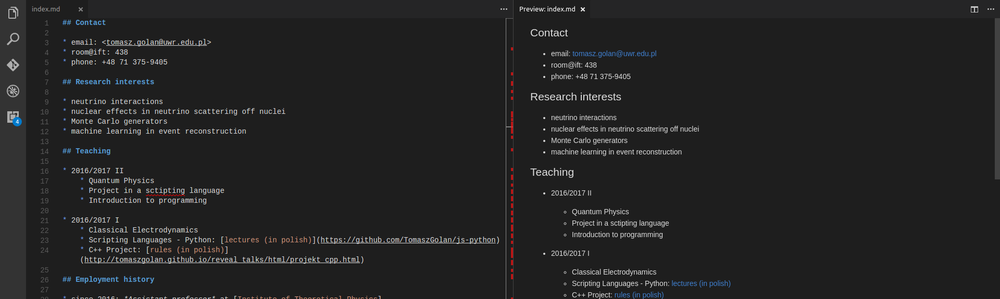
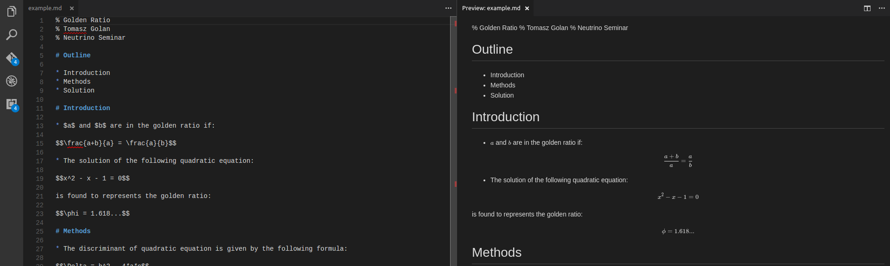

% Introduction to Markdown
% Tomasz Golan
% Neutrino Division Seminar

# 

## Outline

---

* [Markdown basics](#markdown)
* [Pandoc](#pandoc)
* [Web page](#web-page-src)
* [Presentation](#presentation-src)

#

## Markdown

---

<br>

* lightweight markup language

* designed for HTML

* possible to generate many other formats: LaTeX, pdf, beamer...

## Markdown - headers

---

<div class=left>

<br>

```
# Header

## Subheader

### Subsubheader

#### Subsubsubheader
```

</div>
<div class=right>

# Header

## Subheader

### Subsubheader

#### Subsubsubheader

</div>

## Markdown - text formatting

---

<div class=left>

<br>

```
A blank line - new paragraph.

*Text encapsulated in stars*

**Text encapsulated in double stars**

<font color=red>
HTML tags can be used directly.
</font>
```

</div>
<div class=right>

<br>

A blank line - new paragraph.

*Text encapsulated in stars*

**Text encapsulated in double stars**

<font color=red>
HTML tags can be used directly.
</font>
</div>

## Markdown - bullet list

---

<div class=left><br>

```
Bullet list:

* one can use stars
- or dash
* it really does not matter
```

</div>
<div class=right>

Bullet list:

* one can use stars
- or dash
* it really does not matter

</div>

## Markdown - numbered list

---

<div class=left><br>

```
Numbered list:

1. one can use any number
9. it really does not matter
4. the list will be well ordered
```

</div>
<div class=right>

Numbered list:

1. one can use any number
9. it really does not matter
4. the list will be well ordered

</div>

## Markdown - math

---

<div class=left><br>

One can use LaTeX syntax:

```
$$E = \frac{1}{2}\int\limits_0^c mx dx$$
```

</div>
<div class=right><br>

$$E = \frac{1}{2}\int\limits_0^c mx dx$$

</div>

## Markdown - tables

---

<div class=left>

```
| family I | family II | family III | 
|:---------|:---------:|-----------:|
| $e$      | $\mu$     | $\tau$     |
| $\nu_e$  | $\nu_\mu$ | $\nu_\tau$ |
```

<br>

* `|:--|` - left
* `|:-:|` - center
* `|--:|` - right

</div>
<div class=right><br><br>

| family I | family II | family III | 
|:---------|:---------:|-----------:|
| $e$      | $\mu$     | $\tau$     |
| $\nu_e$  | $\nu_\mu$ | $\nu_\tau$ |

</div>

## Markdown - code

---

<div class=left>

* code listing can be obtained by encapsulating a code in ```

* one can also specify the language, e.g. ```cpp

```
 ```

 some code

 ```
```

</div>
<div class=right><br><br>

```
#include <iostream>

int main() {
    std::cout << "Hello World!\n";

    return 0;
}
```

</div>

## Markdown - misc

---

<div class=left><br><br>

```
Horizontal rule

---

[Link](http://neutrino.ift.uni.wroc.pl/)

---


```

</div>
<div class=right>

Horizontal rule

---

[Link](http://neutrino.ift.uni.wroc.pl/)

---


</div>

#

## Pandoc

---

* Pandoc is a universal document converter

* markdown, HTML, LaTeX, Beamer, ODT, ...

* more info: [pandoc website](http://pandoc.org/)

## Pandoc - demo

---

<div width=100% height=600>
<iframe src="http://pandoc.org/try/" width=100% height=600></iframe>
</div>

## Pandoc - examples

---

* Standalone HTML: 

```
pandoc -s input.md -o output.html
```

* PDF: 

```
pandoc input.md -o output.pdf
```

* Beamer:

```
pandoc -t beamer input.md -o output.pdf
```

* Beamer with template:

```
pandoc -t beamer -H template.tex input.md -o output.pdf
```

* LaTeX:

```
pandoc -s input.md -o output.tex
```

#

## Web page src

---

```
## Contact

* email: <tomasz.golan@uwr.edu.pl>
* room@ift: 438
* phone: +48 71 375-9405

## Research interests

* neutrino interactions
* nuclear effects in neutrino scattering off nuclei
* Monte Carlo generators
* machine learning in event reconstruction

## Teaching
...
```

[src](https://raw.githubusercontent.com/TomaszGolan/ift_webpage/master/src/index.md)

## Web page - pandoc

---

```
pandoc -s index.md -o index.html
```

<div width=100% height=600>
<iframe style="background: #FFFFFF;" src="../html/ift_example.html" width=100% height=500></iframe>
</div>

## Web page - markdown-styles

---

```
generate-md --layout src/mixu-radar-mod --input src/index.md --output www
```

<div width=100% height=600>
<iframe style="background: #FFFFFF;" src="http://www.ift.uni.wroc.pl/~tgolan/" width=100% height=500></iframe>
</div>

## Web page - preview example

---



#

## Presentation src

---

```
% Golden Ratio
% Tomasz Golan
% Neutrino Seminar

# Outline

* Introduction
* Methods
* Solution

# Introduction

* $a$ and $b$ are in the golden ratio if:

$$\frac{a+b}{a} = \frac{a}{b}$$

* The solution of the following quadratic equation:

$$x^2 - x - 1 = 0$$

is found to represents the golden ratio:

$$\phi = 1.618...$$

# Methods

* The discriminant of quadratic equation is given by the following formula:

$$\Delta = b^2 - 4*a*c$$

* And the solutions are given by:

$$x = \frac{-b \pm \sqrt{\Delta}}{2a}$$

# Solution

* The following solution can be found:

$$x_1 = 1.618033988749895$$
$$x_2 = -0.6180339887498949$$

* The first one is the golden ratio
```

## Presentation - preview

---



## Presentation - template

---

* *header.tex* with custom options (optional)

```
\setbeamertemplate{footline}[frame number]
```

* To include custom options use `-H` flag:

```
pandoc -t beamer -H header.tex example.md -o example.pdf
```

* The output PDF file: [result](http://www.ift.uni.wroc.pl/~tgolan/talks/example.pdf)

## Presentation - LaTeX src

---

```
pandoc -t beamer example.md -o example.tex
```

```
\begin{frame}{Outline}

\begin{itemize}
\tightlist
\item
  Introduction
\item
  Methods
\item
  Solution
\end{itemize}

\end{frame}

\begin{frame}{Introduction}

\begin{itemize}
\tightlist
\item
  \(a\) and \(b\) are in the golden ratio if:
\end{itemize}

\[\frac{a+b}{a} = \frac{a}{b}\]

\begin{itemize}
\tightlist
\item
  The solution of the following quadratic equation:
\end{itemize}

\[x^2 - x - 1 = 0\]

is found to represents the golden ratio:

\[\phi = 1.618...\]

\end{frame}

\begin{frame}{Methods}

\begin{itemize}
\tightlist
\item
  The discriminant of quadratic equation is given by the following
  formula:
\end{itemize}

\[\Delta = b^2 - 4*a*c\]

\begin{itemize}
\tightlist
\item
  And the solutions are given by:
\end{itemize}

\[x = \frac{-b \pm \sqrt{\Delta}}{2a}\]

\end{frame}

\begin{frame}{Solution}

\begin{itemize}
\tightlist
\item
  The following solution can be found:
\end{itemize}

\[x_1 = 1.618033988749895\] \[x_2 = -0.6180339887498949\]

\begin{itemize}
\tightlist
\item
  The first one is the golden ratio
\end{itemize}

\end{frame}
```