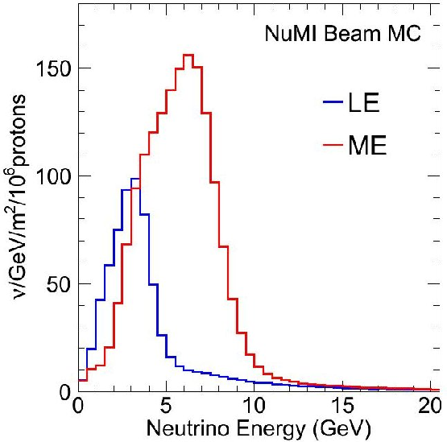
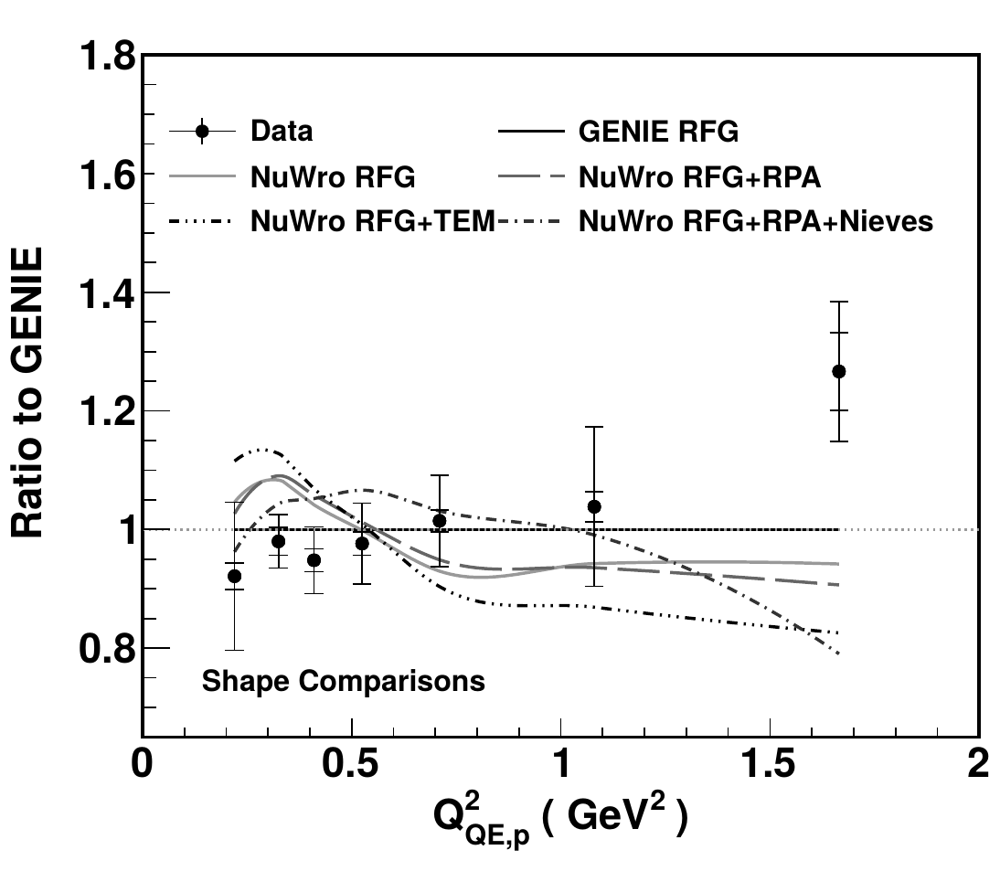
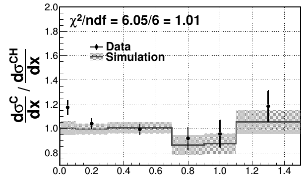

% MINERvA Review
% Tomasz Golan
% Neutrino Seminar, 14.11.2016

## Postdoc summary

---

**University of Rochester**

*Department of Physics and Astronomy*

MINERvA (prof. Kevin McFarland)

---

* flux systematic errors
* physics reconstruction using machine learning
* generator group coordinator
* production group leader

**Fermi National Accelerator Laboratory**

*Scientific Computing Division*

GENIE (dr. Gabe Perdue)

---

* nuclear effects in GENIE
* automated validation system
* "user support"

#

## Main INjector ExpeRiment $\nu$-A

## MINERvA Experiment

---

* MINERvA is a neutrino-scattering experiment at Fermilab
* Collaboration of about 50-100 physicist
* NuMI beam is used to measure cross section for neutrino-nucleus interactions
* The detector includes several different nuclear targets

## Detector

---

## Nuclear targets

---

## NuMI Beamline

----

<iframe data-autoplay width="420" height="315" src="https://www.youtube.com/embed/U_xWDWKq1CM"></iframe>

## Low vs Medium Energy

---

 

* by changing distance between horns one can change energy spectrum

* by changing horns polarization one can switch between neutrino and anti-neutrino mode

#

## Flux

## NuMI Beam Simulation

---

* Flux simulation starts with a Geant4 with the NuMI geometry

* All of the information about interactions leading to neutrino are stored

* The results of the simulation are corrected by external data

* *Similar approach to the one T2K used*

## Hadron Scattering Data

---

* NA49 - charged hadron production in proton scattering off thin targets

* *FLUKA is used to scale proton energy from $158$ to $120$ GeV*

* MIPP - charged hadron production on thin target and NuMI target replica

## NA49 Data

---

## MIPP data

---

## Reweighting

---

$$w_{HP} = \frac{f_{data}(x_F, p_T, E)}{f_{MC}(x_F, p_T, E)}, ~~~~~ f\equiv\frac{E}{\sigma}\frac{d^3\sigma}{dp^3}$$

* Using external hadron production data events are weighted using the above formula

* An event is reweighted on "interaction-by-interaction" basis

* Whenever possible - "thick" target data is used

## Uncertainties

---

* *Many-Universes* method is used to propagate external data uncertainties to our flux

* for each universe (*u*) data central value is shifted (respect to data uncertainties)

$$w_u \sim \prod_i w_{HP, u, i}$$

#

## Flux history

## Flux generations

---

* Generation 0 -> no MIPP data

* Generation 1 -> MIPP thin target data + other improvements

* Generation 2 -> MIPP thick target data + other improvements

## Flux vs publications

---

| **Flux** | **Analysis** | **Reference** |
|:--------:|:------------:|:-------------:|
| Generation 0 | $\nu_\mu$ CCQE | PRL 111 (2013) 022502 |
| Generation 0 | $\bar{\nu_\mu}$ CCQE | PRL 111 (2013) 022501 |
| Generation 1 | $\nu_\mu$ muon + proton | PRD 91 (2015) 071301 |
| Generation 1 | $\nu_\mu$ CC $\pi^\pm$ | PRD 92 (2015) 092008 |
| Generation 1 | $\bar{\nu_\mu}$ CC $\pi^0$ | PLB 749 (2015) 130 |
| Generation 1 | Coherent $\pi$ | PRL 113 (2014) 261802 |
| Generation 1 | CC target ratios | PRL 112 (2014) 231801 |

## Generation 0 vs Generation 2 (thick off)

---

## Generation 1 vs Generation 2 (thick off)

---

##  Generation 2 (thin vs thick)

---

## Generation 2: ratio

---

#

## Flux constraints

## $\nu e$ constraint

---

* Weighting up universes that agree better with data

* Experimental signature is a very forward single electron in the finale state

## Generation 1 + $\nu e$

---

## low-$\nu$ method

---

$$\frac{d\sigma}{d\nu} = A + B\frac{\nu}{E} - \frac{C}{2}\frac{\nu^2}{E^2}$$

* Differential cross-section can be expressed by the above formula

* It is a constant for $\frac{\nu}{E} \rightarrow 0$

* It can be used to constraint the flux prediction (with high-energy normalization taken from other measurements, like NOMAD)

## low-$\nu$ vs generation 2

---

#

## CCQE measurements

## CCQE-"true" aka "1-track"

---

| **Flux** | **Analysis** | **Reference** |
|:--------:|:------------:|:-------------:|
| Generation 0 | $\nu_\mu$ CCQE | PRL 111 (2013) 022502 |
| Generation 0 | $\bar{\nu_\mu}$ CCQE | PRL 111 (2013) 022501 |

 

* require only muon track

* target -> scintillator (CH)

## High-$Q^2$ candidates

---

## Low-$Q^2$ candidates

---

## Background

---

## Background subtraction

---

## $\nu_\mu$ CCQE

---

## $\bar\nu_\mu$ CCQE

---

## CCQE-"like" aka "muon+proton"

---

| **Flux** | **Analysis** | **Reference** |
|:--------:|:------------:|:-------------:|
| Generation 1 | $\nu_\mu$ muon + proton | PRD (2015) 071301 |

 

* CC $\nu_\mu$ on $CH$

* require a muon, at least one proton, and no pions in the final state

* based on hadronic kinematics

* *proton kinetic energy > 110 MeV*

## $\nu_\mu$ CCQE-like

---

#

## Pion production measurements

## Charged pion production

---

CC $1\pi^\pm$

---

* require a muon and exactly one charged pion

* $W < 1.4$ GeV

CC $N\pi^\pm$

---

* require a muon and at least one charged pion

* $W < 1.8$ GeV

## Invariant mass

---

 

$$E_\nu = E_\mu + E_{recoil}$$
$$Q^2 = 2E_\nu(E_\mu  - |\vec p_\mu|\cos\theta_\mu) - m_\mu^2$$
$$W_{exp}^2 = M_p^2 - Q^2 + 2M_pE_{recoil}$$

 

* $E_{recoil}$ is measured colorimetrically

## Backrounds vs invariant mass

---

## CC $1\pi^\pm$

---

## CC $N\pi^\pm$

---

## $\bar\nu_\mu$ CC $1\pi^0$

---

* require a muon and a single neutral pion (visible as two photons)
* about 70% of background - multipion events $\pi^0 + \pi^\pm$
    * $pi^\pm$ is not tracked
    * $\pi^-\rightarrow\pi^0$
* the rest of the background is mostly due to energy deposit by $\pi^-$ and neutrons misidentified as photons

## Invariant mass of $\gamma\gamma$

---

  

The $\gamma\gamma$ invariant mass is reconstructed from the photon energies ($E_1$, $E_2$):

$$m_{\gamma\gamma}^2 = 2E_1E_2(1 - \cos\theta_{\gamma\gamma})$$

## Differential cross sections

---

## Coherent pion production

---

* require two final state particles: $\mu^\pm$ and $\pi^\mp$ and no extra visible recoil

## Background

---

## Low energy transfer requirement

---

## Total cross section

---

## Differential cross section (energy)

---

## Differential cross section (angle)

---

#

## Other measurements highlights

## Inclusive $\nu_\mu$ CC ratios

---

* shadowing at low $x$

* no MEC in simulations (high $x$ dominated by QE)

## DIS $\nu_\mu$ CC ratios

---

* $W > 2$ GeV and $Q^2 > 1$ GeV$^2$

* $E_\nu$ up to 50 GeV

## Available energy vs momentum transfer

---

 

* $E_{avail}$ - sum of proton and charged pion kinetic energy and neutral pion, electron, and photon total energy

## NC diffractive $\pi^0$ production

---

 

* The most plausible source of the excess seen in the data is diffractive NC $\pi^0$ production from hydrogen in the scintillator target of MINERvA.

## CC pion production (muon variables)

---

 

* $\nu$-CC($\pi^+$) and $\bar\nu$-CC($\pi^0$)

* total cross section

* differential cross sections:

    * muon momentum
    * muon angle
    * $Q^2$

## Kaon production

---

#

## Summary

---

* MINERvA offers an unique opportunity to measure neutrino cross section on different nuclear targets

* There is still a lot of collected data to analyze (e.g. in nuclear target region)

* Medium energy data will allow to study more precisely DIS (and transition region?)
