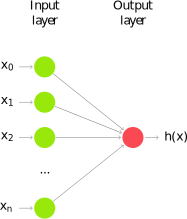
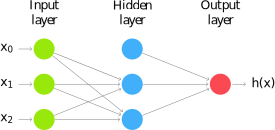
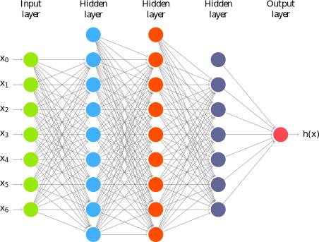

% Machine Learning for MINERvA Physics Reconstruction
% Tomasz Golan
% IFT seminar, 10.03.2017

## Outline

---

* [Motivation](#motivation)
* [Introduction to MINERvA](#minerva)
* [Introduction to Machine Learning](#machine-learning)

#

## Motivation

*(for MINERvA experiment)*

## Neutrino oscillations

---

<div class='left'>
<hr style="height:10pt; visibility:hidden;" />

* three neutrino flavors: electron, muon, tau
* created in one of the flavors can be detected with a different flavor later
* The Nobel Price in Physics 2015: Takaaki Kajita and Arthur B. McDonald (Super-K, SNO)

</div>
<div class='right'>


src: [nobelprize.org](http://www.nobelprize.org/nobel_prizes/physics/laureates/2015/popular-physicsprize2015.pdf)

## Oscillation experiment

---

<svg id="nu_osc_exp" width="900" height="600"></svg>
<script src="../js/nu_osc_exp.js"></script>

#

## MINERvA

<font color=red>M</font>ain <font color=red>IN</font>jector <font color=red>E</font>xpe<font color=red>R</font>iment <font color=red>$\nu$-A</font>

## MINERvA Experiment

---

<div class=left>
<hr style="height:10pt; visibility:hidden;" />

* MINERvA is a neutrino-scattering experiment at Fermilab
* Collaboration of about 50-100 physicist
* NuMI beam is used to measure cross section for neutrino-nucleus interactions
* The detector includes several different nuclear targets

</div>


## NuMI Beamline

----


<iframe data-autoplay width="420" height="315" src="https://www.youtube.com/embed/U_xWDWKq1CM"></iframe>

## Low vs Medium Energy

---

<div class=left><br>

* by changing distance between horns one can change energy spectrum

* by changing horns polarization one can switch between neutrino and anti-neutrino mode

</div>
<div class=right>


</div>

## LE vs ME analyses

---

<div class=left><br>

* LE analyses: almost done
* ME analyses: starting now
    * more energy
    * more particles in the final state
    * more *messy* events
    * more problems with the reconstruction

</div>
<div class=right><br>


*LE event example*

</div>

## MINERvA Detector

---


## Nuclear targets

---


## Event example 1

---


<br>*courtesy of G. Perdue*

## Event example 2

---


<br>*courtesy of G. Perdue*

## Vertex Reconstruction

---

<div class=left>
<hr style="height:10pt; visibility:hidden;" />

* tracking based algorithms fail for high energy events

* "by eye" method is very often more accurate

* idea: use algorithms for images analysis and pattern recognition

</div>
<div class=right>


</div>

#

## Machine Learning

## Why ML?

---

<div class='left'>

* [ImageNet](http://image-net.org) is an image database

* Annual competition for classification
    * 2010: 71.8%
    * 2011: 74.3%
    * 2012: 84.0%
    * 2013: 88.2%
    * 2014: 93.3%
    * 2015: <font color=red>96.4%</font>

* Humans: about <font color=red>95%</font>
</div>
<div class='right'>

* Why humans fail?


Siberian Husky or Alaskan Malamute?

</div>

## Understanding CNN

---

<font size=6>

> If you can't explain it simply, you don't understand it well enough.
>
<div style="text-align:right;">Albert Einstein</div>

</font>

---

<br>

* lets start from [linear regression](#linear-regression)
* then introduce a [single neuron](#single-neuron) and [neural networks](#neural-networks)
* to finally get to [convolutional neural networks](#convolutional-neural-networks)

#

## Linear Regression

## Notation

---

* Hypothesis (for convenience $x_0 = 1$):
$$h(x) = w_0 + w_1x_1 + ... + w_nx_n = \sum\limits_{i=0}^n w_i x_i = w^T x$$
* Cost function:
$$f(w) = \frac{1}{2}\sum\limits_{i=0}^n\left(h (x^{(i)}) - y^{(i)}\right)^2$$
* Learning step (gradient descent, $\alpha$ - training rate):
$$w_j = w_j - \alpha\frac{\partial f(w)}{\partial w_j} = w_j + \alpha\sum\limits_{i=0}^n\left(y^{(i)} - h (x^{(i)})\right)x_j$$

## Example

---


<div class='right'><br>

- **epoch** = one loop over the whole training sample

- for each feature vector weights are updated using **gradient descent** method

</div>

## Classification

---


<div class="right"><br>

- target: $y = 0, 1$

- not really efficient for classification

- imagine having some data ~ 100

- logistic function does better job
</div>

## Classification

---


## Logistic function

---


<div class='left'><br>

* Logistic function:
$$g(z) = \frac{1}{1 + e^{-z}}$$

* Hypothesis:
$$h(x) = g(w^Tx) = \frac{1}{1 + e^{-w^Tx}}$$
</div>

## Results

---


## Why do we need neural networks?

---

<div class=left><br>

* We can do classification

* We can do regression

* But real problems are nonlinear

</div>
<div class=right>


</div>

## Trick

---

<div class="left">

* Feature vector:
$$(x,y) \rightarrow (x,y,x^2,y^2)$$

* Hypothesis:
$$h (x) = \frac{1}{1 + e^{-w_0 - w_1x - w_2y - w_3x^2 - w_4y^2}}$$

*In general, adding extra dimension by hand would be hard / impossible.
Neural networks do that for us.*
</div>


#

## Neural Networks

## Neuron

---

<div class=left>



</div>
<div class="right"><br>

- neuron = activation function:
    - linear
    - binary step
    - logistic
    - tanh
    - relu
    - ...

</div>

## AND gate

---

<div class="left">


| | | | | |
|:---:|:---:|:---:|:---:|:---:|
| $x_1$ | 0 | 1 | 0 | 1 |
| $x_2$ | 0 | 0 | 1 | 1 |
| AND | 0 | 0 | 0 | 1 |

</div>
<div class="right"><br>

- Hypothesis = logistic function:

$$h(x) = \frac{1}{1 + e^{-w^Tx}}$$

---

Intuition:

- $w_0 \ll 0$
- $w_0 + w_1 \ll 0$
- $w_0 + w_2 \ll 0$
- $w_0 + w_1 + w_2 \gg 0$

</div>

## AND gate - learning

---

<div class=left>
<div id="and_w" style="width:600px;height:600px;"></div>
</div>
<div class=right>
<div id="and_h" style="width:600px;height:600px;"></div>
</div>
<script src="../js/and_learning.js"></script>

## Non-linear problem: XOR gate

---


## Neural network for XOR

---

> x XOR y = (x AND NOT y) OR (y AND NOT x)

<div class=left>

</div>
<div class=right>

```
Hidden neuron #1:

0, 0 = 0.000555
0, 1 = 0.000001
1, 0 = 0.263002
1, 1 = 0.000827

Hidden neuron #2:
0, 0 = 0.000567
0, 1 = 0.290434
1, 0 = 0.000002
1, 1 = 0.001137

Final results:
0 XOR 0 = 0.035760
0 XOR 1 = 0.956746
1 XOR 0 = 0.956866
1 XOR 1 = 0.026566
```
</div>

## Tensorflow playground

---

<div width=100% height=600>
<iframe src="http://playground.tensorflow.org" width=100% height=600></iframe>
</div>

## Why do we need convolutional NN?

---

<div class=left><br><br>

* The more complicated problem is the more neurons we need

    * so more CPU/GPU time
    * and more memory

</div>
<div class=right>



</div>