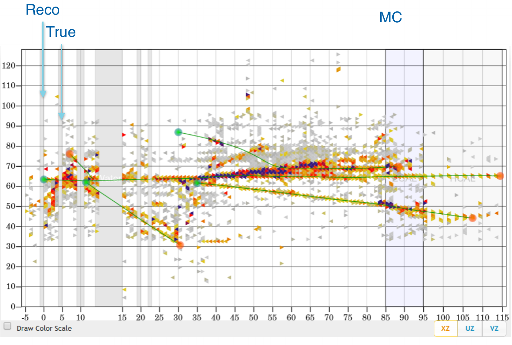
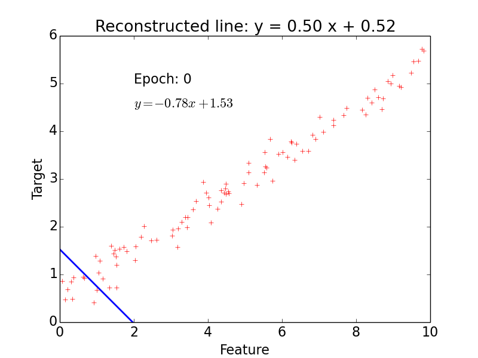
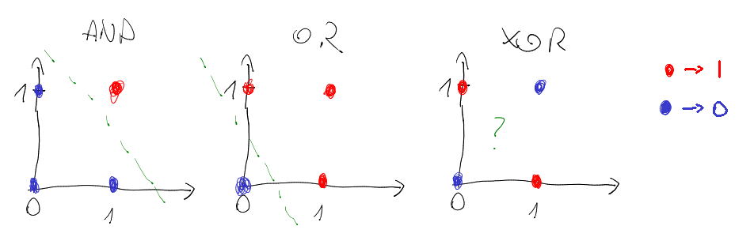
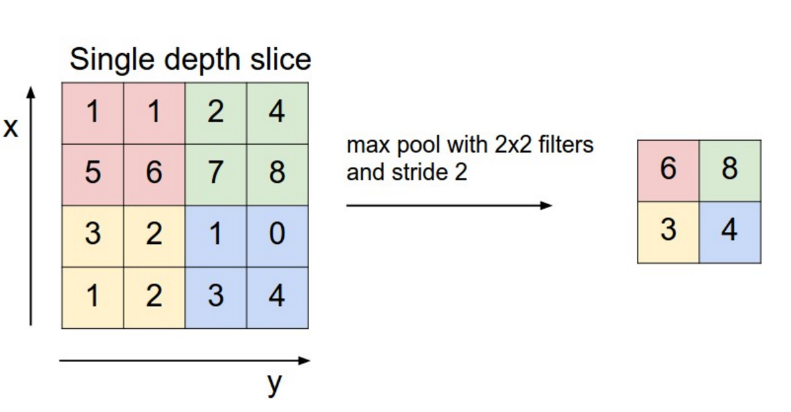
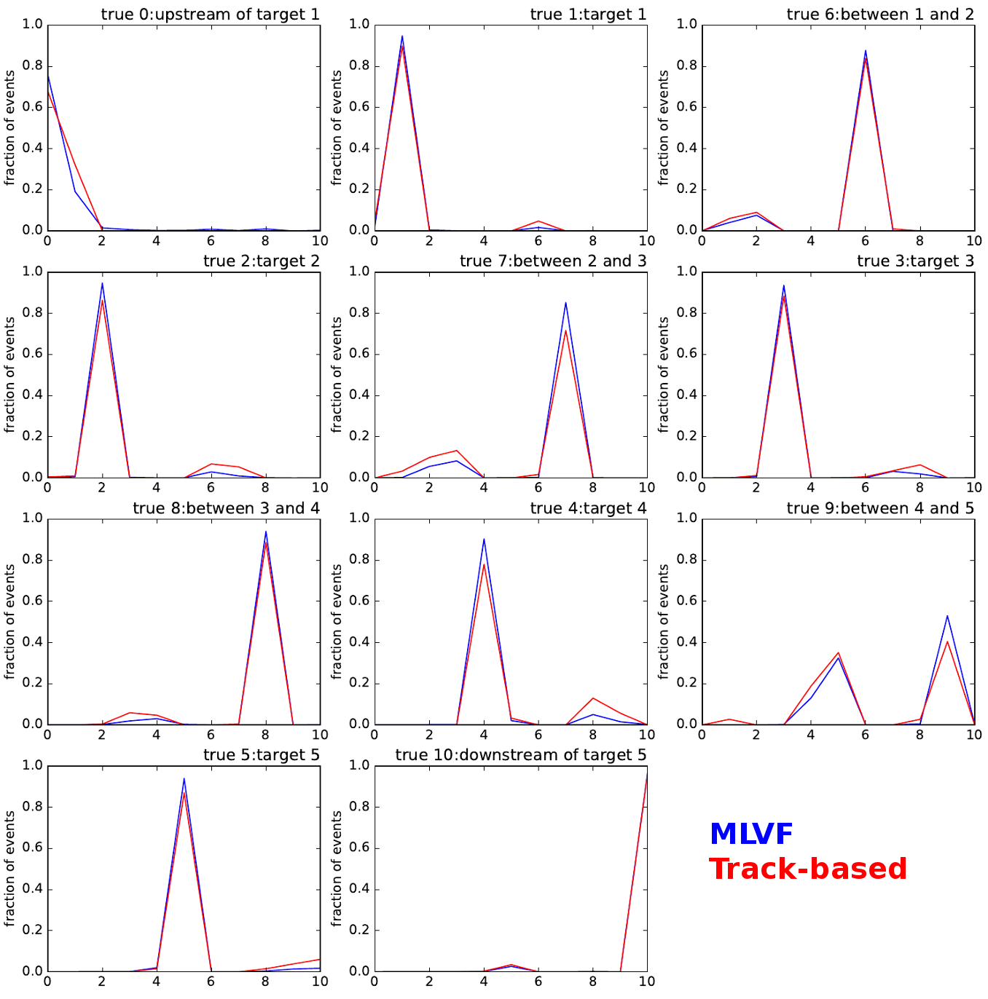
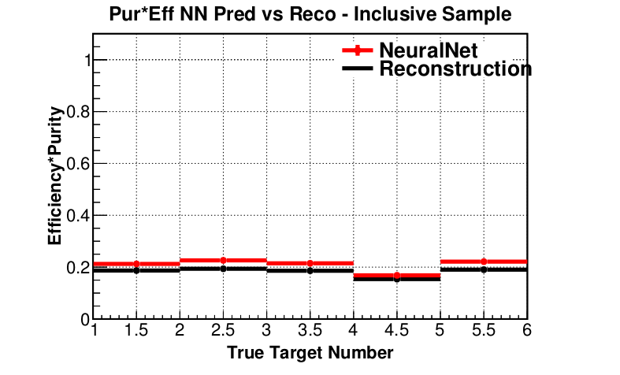
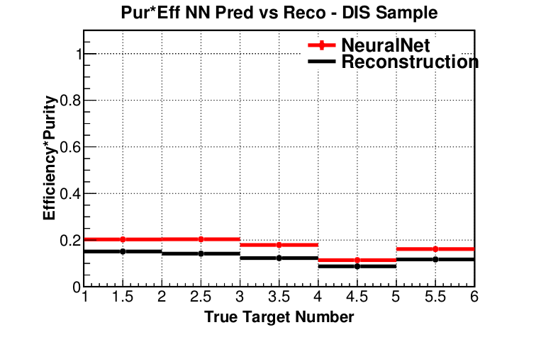
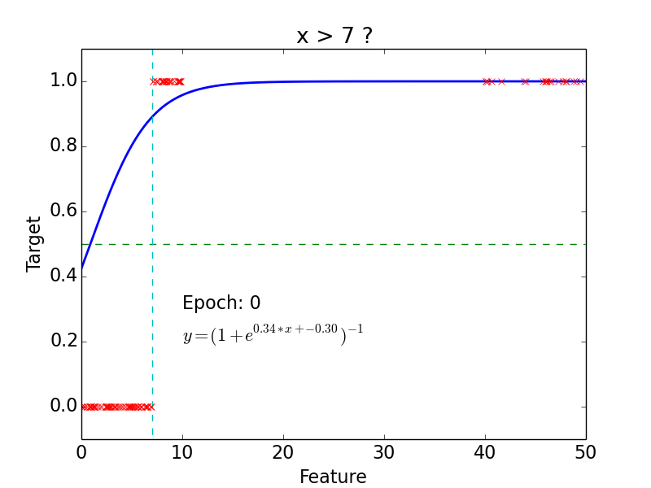
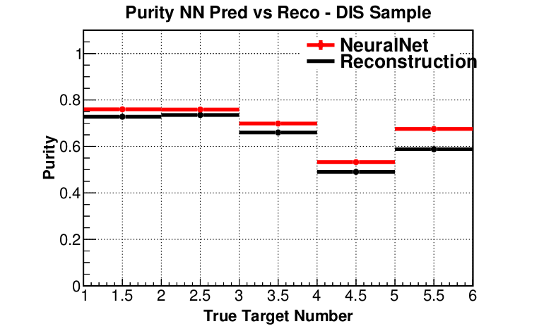

% Machine Learning for MINERvA Physics Reconstruction
% T. Golan
% Warsaw, 11.01.2017

<div class='footer'>
Navigate:
<br> &emsp; PgDn / PgUp - next / previous slide
<br> &emsp; Esc - expo mode
</div>

# Outline

- [Introduction I: MINERvA](#minerva-experiment)
- [Introduction II: Machine Learning](#machine-learning)
- [MLMPR: first attempts](#mlmpr-first-attempts)

#

## <font color=red>M</font>ain <font color=red>IN</font>jector <font color=red>E</font>xpe<font color=red>R</font>iment <font color=red>$\nu$-A</font>

## MINERvA Experiment

---

<div class=left>

* MINERvA is a neutrino-scattering experiment at Fermilab
* Collaboration of about 50-100 physicist
* NuMI beam is used to measure cross section for neutrino-nucleus interactions
* The detector includes several different nuclear targets

</div>


## Detector

---


## Nuclear targets

---


## Event example 1

---


<br>*courtesy of G. Perdue*

## Event example 2

---


<br>*courtesy of G. Perdue*

## Vertex Reconstruction

---

* tracking based algorithms fail for high energy events

* "by eye" method is very often more accurate

* idea: use algorithms for images analysis and pattern recognition

#

## Machine Learning

## Why ML?

---

<div class='left'>

* [ImageNet](http://image-net.org) is an image database

* Annual competition for classification
    * 2010: 71.8%
    * 2011: 74.3%
    * 2012: 84.0%
    * 2013: 88.2%
    * 2014: 93.3%
    * 2015: <font color=red>96.4%</font>

* Humans: about <font color=red>95%</font>
</div>
<div class='right'>

* Why humans fail?


Siberian Husky or Alaskan Malamute?

</div>

## Understanding CNN

---

<font size=6>

> If you can't explain it simply, you don't understand it well enough.
>
<div style="text-align:right;">Albert Einstein</div>

</font>

---

<br>

* lets start from [linear regression](#linear-regression)
* then introduce a [single neuron](#single-neuron) and [neural networks](#neural-networks)
* to finally get to [convolutional neural networks](#convolutional-neural-networks)

#

## Linear Regression

## Notation

---

* Hypothesis (for convenience $x_0 = 1$):
$$h(x) = w_0 + w_1x_1 + ... + w_nx_n = \sum\limits_{i=0}^n w_i x_i = w^T x$$
* Cost function:
$$f(w) = \frac{1}{2}\sum\limits_{i=0}^n\left(h (x^{(i)}) - y^{(i)}\right)^2$$
* Learning step (gradient descent, $\alpha$ - training rate):
$$w_j = w_j - \alpha\frac{\partial f(w)}{\partial w_j} = w_j + \alpha\sum\limits_{i=0}^n\left(y^{(i)} - h (x^{(i)})\right)x_j$$

## Example

---


<div class='right'><br>

- **epoch** = one loop over the whole training sample

- for each feature vector weights are updated using **gradient descent** method

</div>

## Classification

---


<div class="right"><br>

- target: $y = 0, 1$

- not really efficient for classification

- imagine having some data ~ 100

- logistic function does better job
</div>


## Why do we need neural networks?

---

- We can do classification

- We can do regression

- But real problems are nonlinear

#

## Neural Networks

## Single Neuron

---


<div class="right"><br>

- neuron = activation function:
    - linear
    - binary step
    - logistic
    - tanh
    - relu
    - ...

- learned using gradient descent

</div>

## Non-linear problem: XOR gate

---



## Neural network for XOR

---


> x XOR y = (x AND NOT y) OR (y AND NOT x)

## Neural Networks

---

* more complicated problems require more neurons


#

## Convolutional Neural Networks

## Idea

---


## Convolution

---


src: [deeplearning.net](http://deeplearning.stanford.edu/wiki/images/6/6c/Convolution_schematic.gif)

## "Clones" of a neuron looking at different part of an image

---


## Convolution Layer

---

<center>*No. of convolved feature vectors / matrices = No. of filters*</center>


## Pooling

---



src: [wildml.com](http://www.wildml.com/2015/11/understanding-convolutional-neural-networks-for-nlp/)

## Pooling - example

---


src: [arxiv](http://arxiv.org/abs/1506.03767)

## CNN example

---


src: [wildml.com](http://www.wildml.com/2015/11/understanding-convolutional-neural-networks-for-nlp/)

#

## MLMPR First Attempts

## What are we looking for?

---

- The first goal is to use CNN to find vertex in nuclear target region

      - **Classification**: upstream of target 1, target 1, plastic between target 1 and target 2, target 2...

- Next steps: NC$\pi^0$? $\pi$ momentum? hadron multiplicities?

## Classification regions

---


##


<div class='right'><br>

## The current best

---

```
test accuracy:        92.67 %

    target 0 accuracy:            75.861 %
    target 1 accuracy:            94.878 %
    target 2 accuracy:            94.733 %
    target 3 accuracy:            93.596 %
    target 4 accuracy:            90.404 %
    target 5 accuracy:            94.011 %
    target 6 accuracy:            87.775 %
    target 7 accuracy:            85.225 %
    target 8 accuracy:            94.109 %
    target 9 accuracy:            53.077 %
    target 10 accuracy:           96.608 %
```

</div>

<br>

## Purity * Efficiency *(preliminary)*

---





## How did we get here?

---

<font size=6>

> In order to attain the impossible, one must attempt the absurd.
>
<div style="text-align:right;">Miguel de Cervante</div>

</font>

---

<div class='left'>

* Some educated guesses
* A little bit of intuition
* And many, many attempts
* ... on 2 GPU's
* ... and later using Titan

</div>
<div class='right'>

* Titan has **18,668** NVIDIA Kepler GPUs


</div>

#

## Summary

---

* ML approach outperforms track-based reconstruction
* Statistics, efficiency and purity is improved for inclusive and DIS samples
* And this is just the beginning

#

## Backup slides

## Linear Classification

---


## Logistic Regression

## Logistic function

---


<div class='left'><br>

* Logistic function:
$$g(z) = \frac{1}{1 + e^{-z}}$$

* Hypothesis:
$$h(x) = g(w^Tx) = \frac{1}{1 + e^{-w^Tx}}$$
</div>

## Classification

---

* Probability of 1:
$$P (y = 1 | x, w) = h(x)$$

* Probability of 0:
$$P (y = 0 | x, w) = 1 - h(x)$$

* Probability:
$$p (y | x, w) = (h(x))^y\cdot(1 - h(x))^{1 - y}$$

##

* Likelihood:
$$L(w) = \prod\limits_{i=0}^n p(y^{(i)} | x^{(i)}, w) = \prod\limits_{i=0}^n (h(x^{(i)}))^{y^{(i)}}\cdot(1 - h(x^{(i)}))^{1 - y^{(i)}}$$

* Log-likelihood:
$$l(w) = \log L(w) = \sum\limits_{i=0}^n y^{(i)}\log h(x^{(i)}) + (1 - y^{(i)})\log (1-h(x^{(i)}))$$

* Learning step (maximize $l(w)$):
$$w_j = w_j + \alpha\frac{\partial l(w)}{\partial w_j} = w_j + \alpha\sum\limits_{i=0}^n\left(y^{(i)} - h (x^{(i)})\right)x_j$$


## Logistic Classification

---




## Non-linear problem

---


## Trick

---

<div class="left">

* Feature vector:
$$(x,y) \rightarrow (x,y,x^2,y^2)$$

* Hypothesis:
$$h (x) = \frac{1}{1 + e^{-w_0 - w_1x - w_2y - w_3x^2 - w_4y^2}}$$

*In general, adding extra dimension by hand would be hard / impossible.
Neural networks do that for us.*
</div>


## AND gate

---

<div class="left">


| | | | | |
|:---:|:---:|:---:|:---:|:---:|
| $x_1$ | 0 | 1 | 0 | 1 |
| $x_2$ | 0 | 0 | 1 | 1 |
| AND | 0 | 0 | 0 | 1 |

</div>
<div class="right"><br>

- Hypothesis = logistic function:

$$h(x) = \frac{1}{1 + e^{-w^Tx}}$$

---

Intuition:

- $w_0 < 0$
- $w_0 + w_1 < 0$
- $w_0 + w_2 < 0$
- $w_0 + w_1 + w_2 > 0$

</div>

## AND gate - learning

---


## Purity *(preliminary)*

---




## Efficiency *(preliminary)*

---


