% The implementation of intranuclear cascade
% Tomasz Golan (on behalf of NuWro Collaboration)
% 03-05.12.2017, NuWro Workshop 2017

Navigate:
  &emsp; PgDn / PgUp - next / previous slide
  &emsp; Space / Shift+Space - next / previous slide
  &emsp; Esc - expo mode

# 

## Cascade by Metropolis

## Intranuclear cascade

---

* Script: N. Metropolis
* Director: J. Sobczyk
* Cast: C. Juszczak, T. Golan, K. Niewczas

<embed src="../img/cascade/cascade.swf" wmode="transparent" quality="high" width="750" height="750" style="margin-top: -150px" scale="default"/>

## Total cross section

---

*src: N. Metropolis et al., Phys. Rev. 110 (1958) 204*

* Nucleons

    * $\sigma_{ii}$ - same isospin
    * $\sigma_{ij}$ - different isospin

* Pions

    * $\sigma_{ii}$ - $\pi^+p$ or $\pi^-n$
    * $\sigma_{ij}$ - $\pi^-p$ or $\pi^+n$

 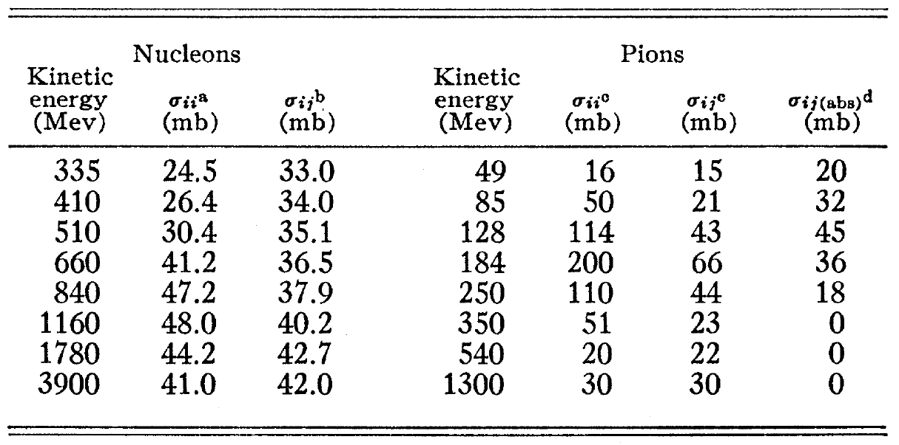

## Total cross section (low energies)

---

*Nucleons below $335$ MeV*

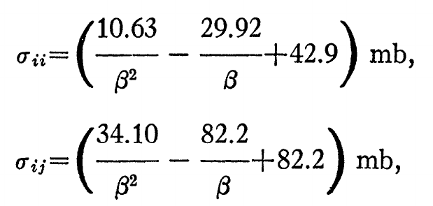

* $\beta$ - velocity of incoming nucleon

*Pions below $51$ MeV*

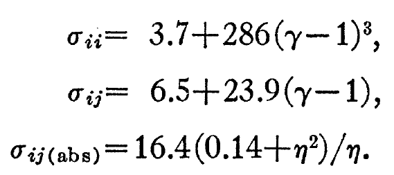

* $\gamma$ - total energy in $m_{\pi^0c^2}$

* $\eta$ - momentum in $m_{\pi^0c}$

## Interaction parameters (nucleons)

---

* $f_{inel}$ - the fraction of pion production

* $f_{\pi}$ - the fraction of single pion production

* angular distribution in CMS

$$\frac{d\sigma}{d\Omega} = A\cos^4\theta + B\cos^3\theta + 1$$

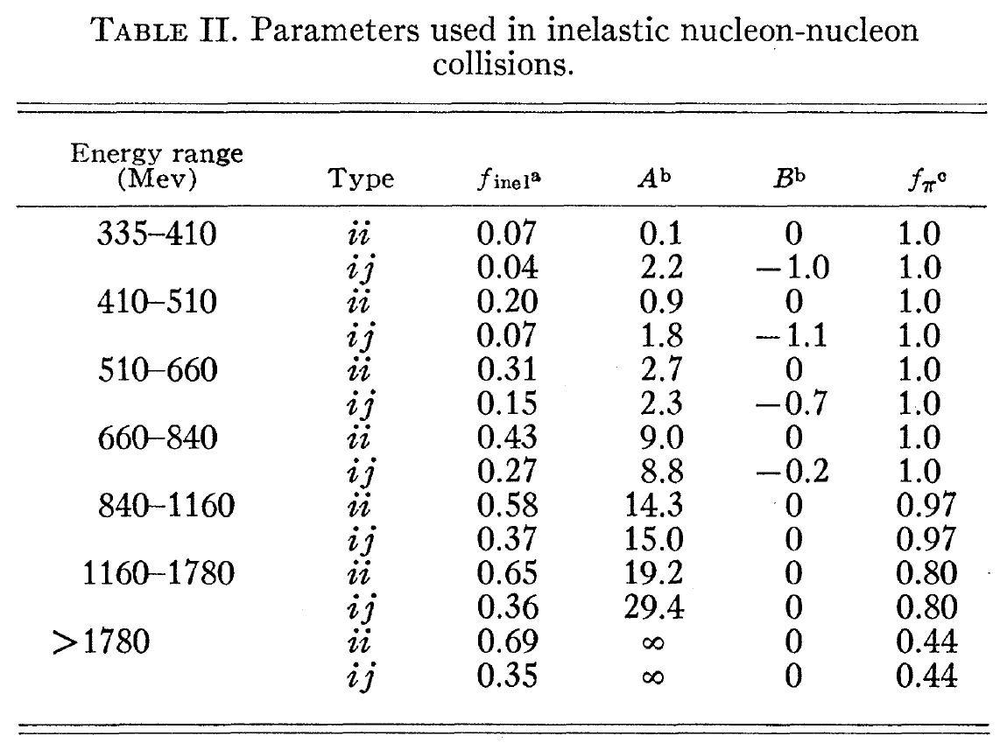

## Interaction parameters (pions)

---

* $f_{inel}$ - the fraction of pion production

* $f_{\pi}$ - the fraction of single pion production

* angular distribution in CMS

$$\frac{d\sigma}{d\Omega} = A\cos^4\theta + B\cos^3\theta + 1$$

* $f_{CE}$ - the fraction (of inelastic events) that is charge exchange

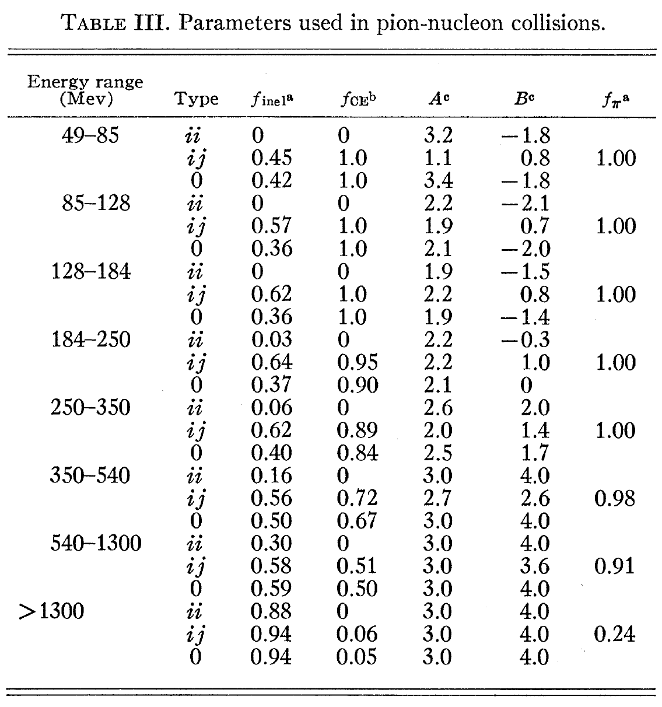

#

## Cascade algorithm

## The main loop

---

General idea

<pre><code class='nohighlight'>
until there are particles to propagate
until there are nucleons in nucleus

    take a particle from the queue
    calculate free path
    move particle

    if there is no interaction
        put the particle back to the queue
    otherwise 
        generate interaction
        put all created particles
        into the queue
</code></pre>

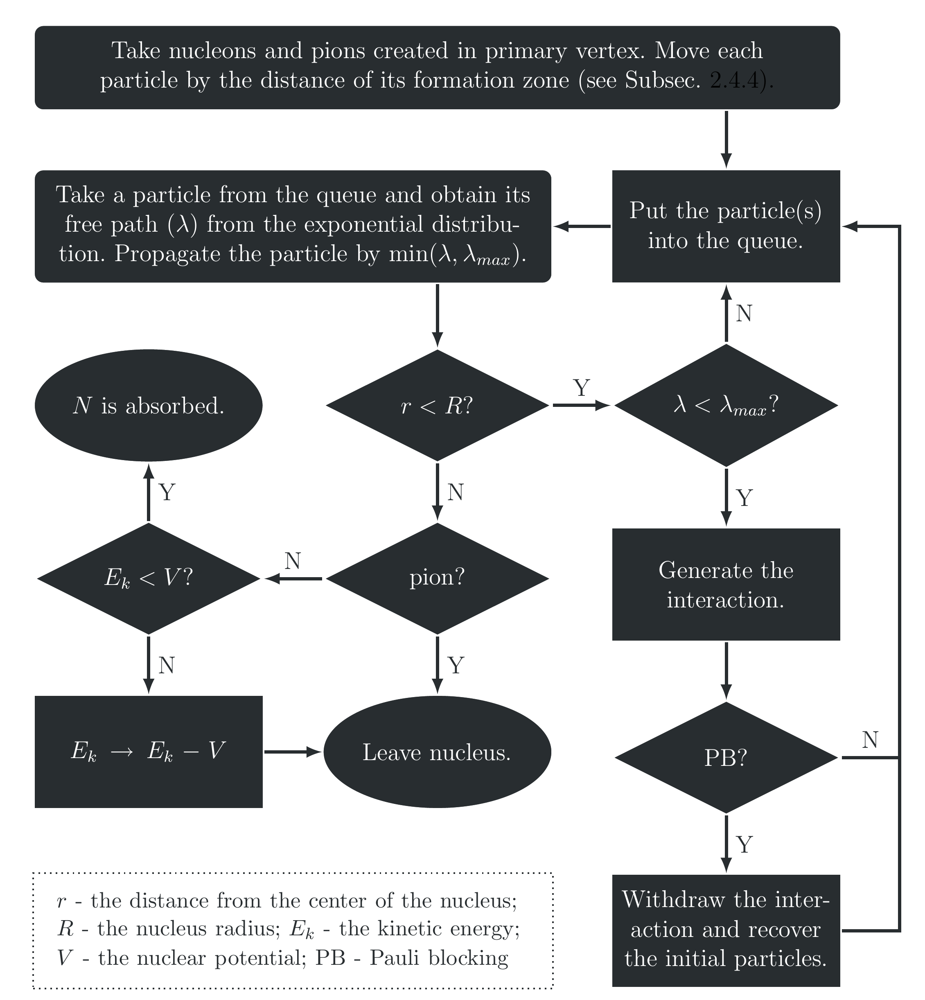

## Free path

---

* The probability of passing $\lambda$ without any interactions    $$ P(\lambda) = e^{-\lambda / \tilde\lambda}$$  
* Mean free path    $$\tilde\lambda = \left[\sigma_p\rho_p(r) + \sigma_n\rho_n(r)\right]^{-1}$$  
* Free path (an interaction happens if $\lambda < 0.2$ fm)    $$\lambda = - \tilde\lambda\cdot\ln(\text{rand[0,1]})$$  

## N-N interactions

---

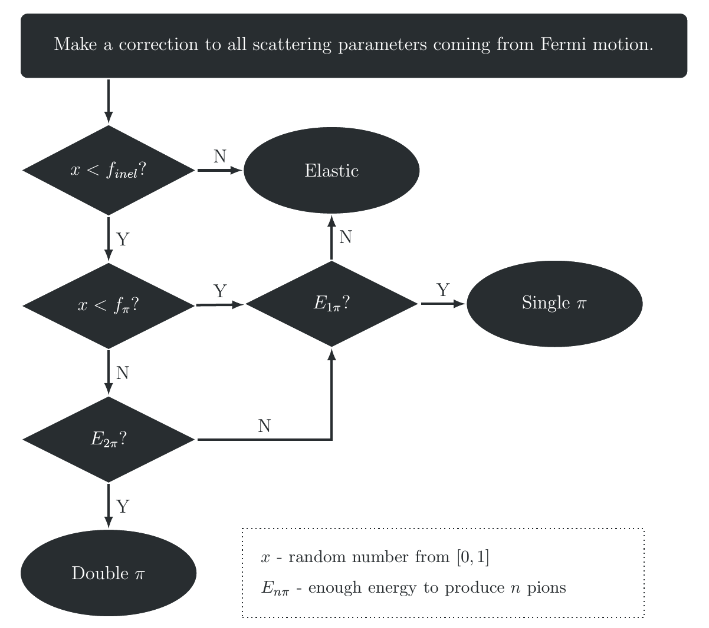

## $\pi$-N interactions

---

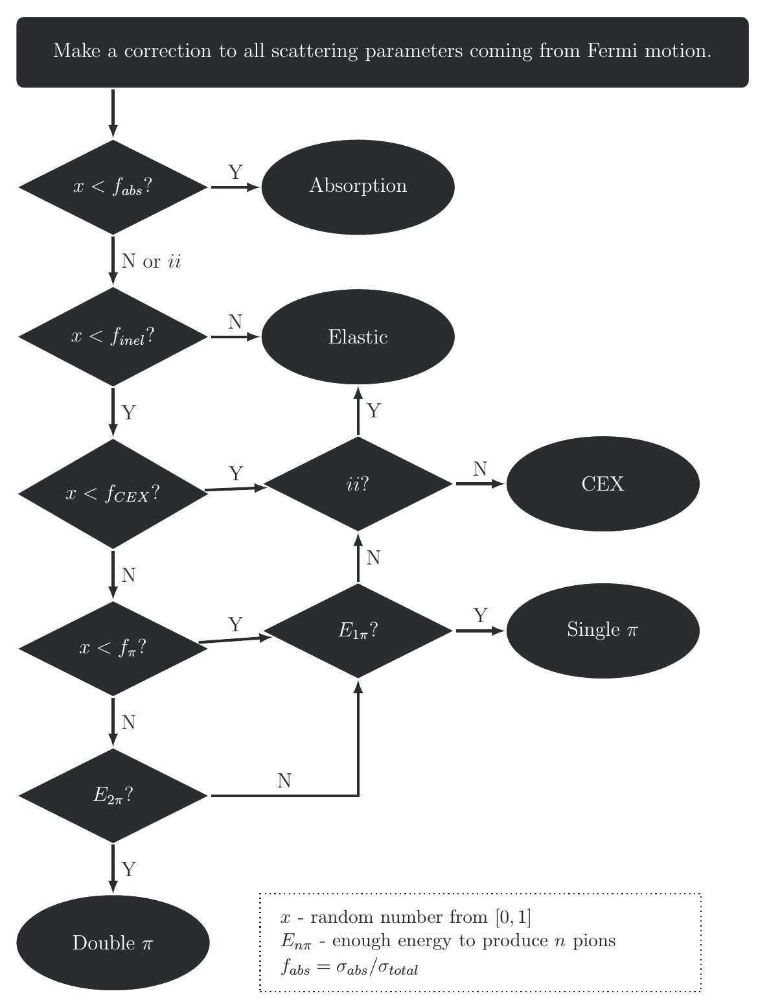

#

## Improvements of cascade model in NuWro (nucleons)

*all changes are done in a way to keep the structure the same*

## N-N inelastic

---

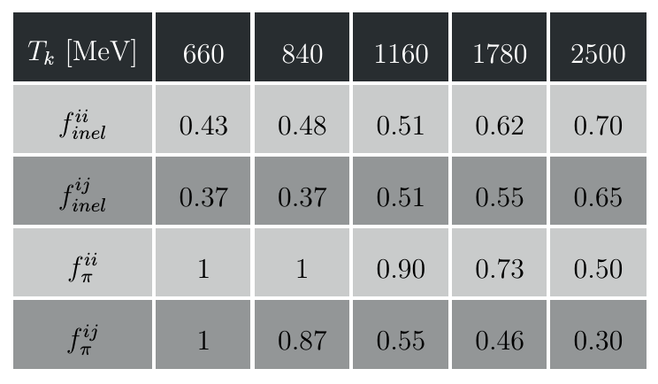

*based on experimental data*

## proton-Carbon scattering

---

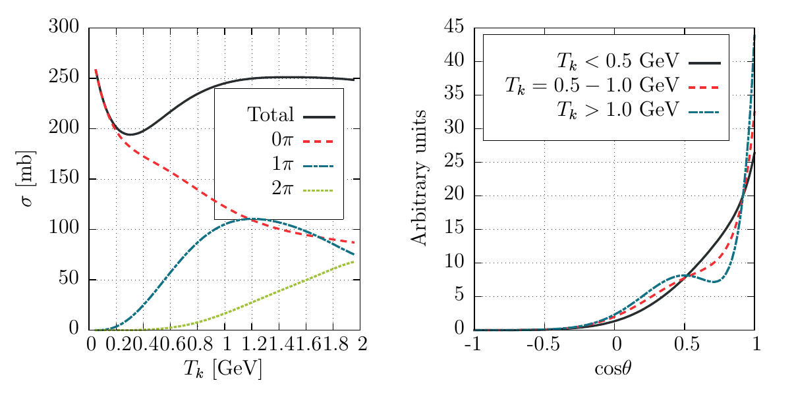

## N-N nuclear correction

---

*src: V.R. Pandharipande and S.C. Pieper, PRC45 (1992) 791*

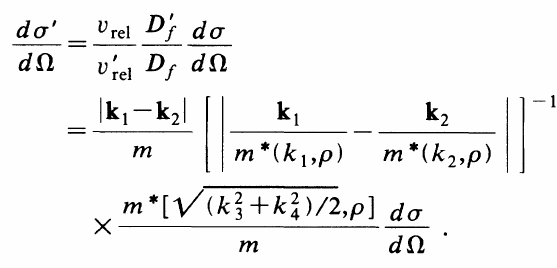

* effective mass calculated using potential form *R.B. Wiringa, PRC38 (1988) 2967*

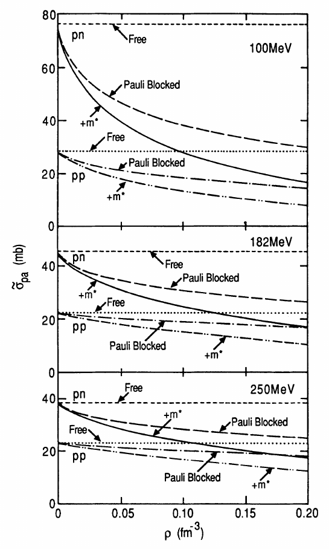

## ArgoNeut data

---

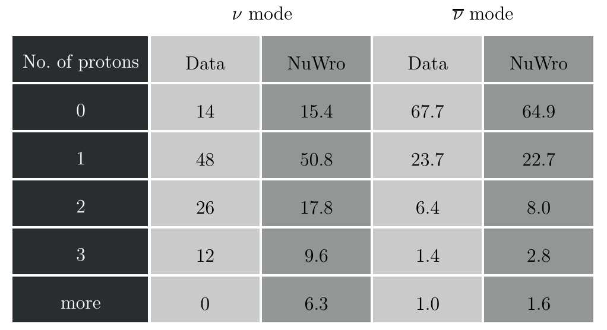

*src: K. Partyka, “Exclusive 1mu+np topologies in ArgoNeuT”, NuInt12, 2012   O. Palamara, “QE or not QE, that is the question”, INT workshop, Seattle, 2013*

## Binding energy

---

* binding energy is subtracted from nucleon energy in the primary vertex

* the value is stored and use later in the cascade 

* nuclear potential is defined as    $$V(r) = E_F(r) + E_B$$  

* nucleon is jailed in a nucleus if    $$T_k < V(r)$$  

#

## Improvements of cascade model in NuWro (pions)

*all changes are done in a way to keep the structure the same*

## Low-energy pions

---

* for low-energy pions ($T_k < 350$ MeV) E. Oset et al (*Phys. Lett. B165 (1985) 13–18*) is used

* $\Delta$ width modification in nuclear matter    $$\frac{1}{2}\tilde\Gamma \rightarrow \frac{1}{2}\tilde\Gamma - \text{Im}\Sigma_\Delta$$  

    * $\tilde\Gamma$ - reduced $\Delta$ width (due to Pauli blocking)
    * $\Sigma_\Delta$ - $\Delta$ self-energy

## $\Delta$ self-energy

---

* the parametrization of $\Delta$ self-energy is taken from *E. Oset et al., Nucl. Phys. A468 (1987) 631–652*    $$\text{Im}\Sigma_\Delta(E_\pi) = -\left[C_Q(\rho/\rho_0)^\alpha + C_{A2}(\rho/\rho_0)^\beta + C_{A3}(\rho/\rho_0)^\gamma\right]$$  

* $C_Q$, $C_{A2}$, $C_{A3}$, $\alpha$, $\beta$, $\gamma$ - functions of pion energy

* $C_{A}$ - pion absorption

* implementation: cross sections 2D tables ($T_k$ and $\rho$)

## Comparison with Oset et al.

---

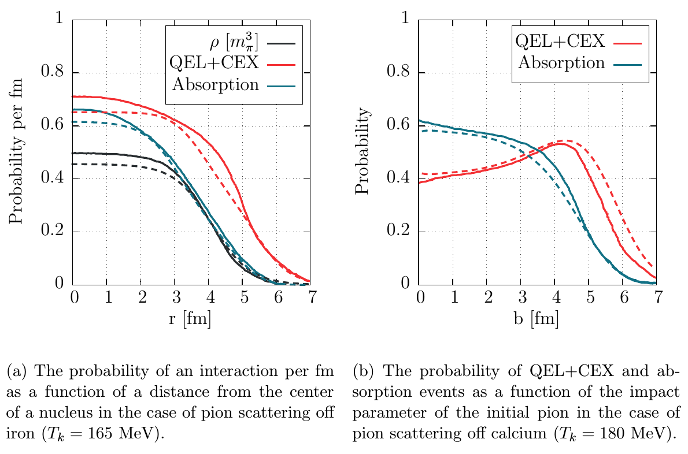

## Comparison with Oset et al.

---

## High-energy pions

---

  

* Metropolis-like tables based on data

* new parameter $f_{2\pi}$ gives the fraction of double pion production among all non-single pion production processes

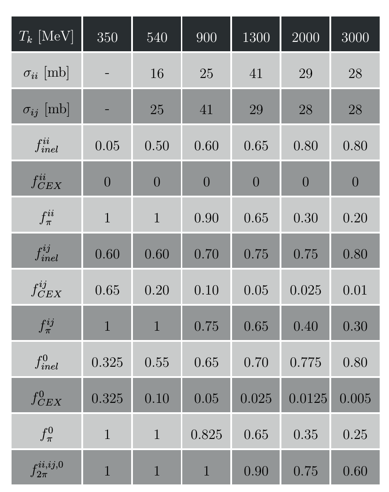

## Charge fragmentation

---

 

* for single pion production see a table on the right

* for double pion production $ii$: half is assumed to be with neutal pion

* all other cases - equally likely

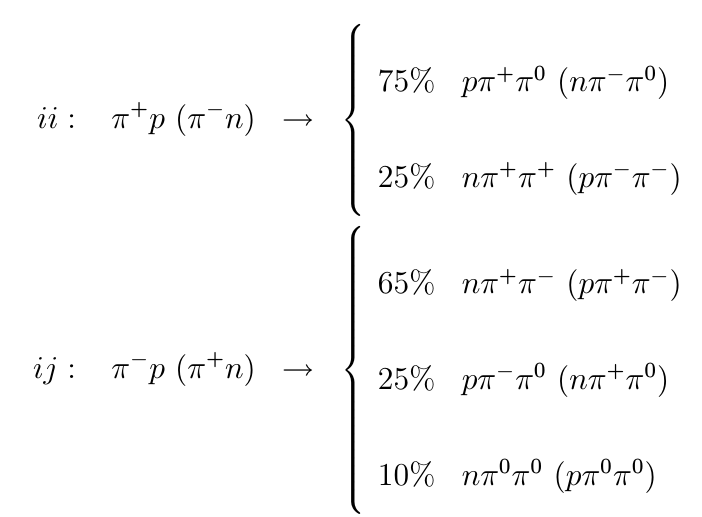

## Angular distributions

---

* for QEL and CEX $\pi$-N scattering (in CMS)    $$\frac{d\sigma}{d\Omega} \sim \sum\limits_{i=0}^{7}a_i\cos^i\theta$$  

* with $a_i$ being extracted from [SAID](http://gwdac.phys.gwu.edu/) model

* separately for each channel ($ii$, $ij$, $0$, and *CEX*)

## Pion-Carbon scattering

---

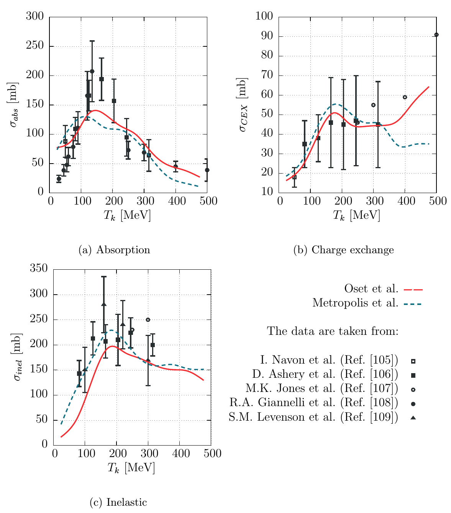

