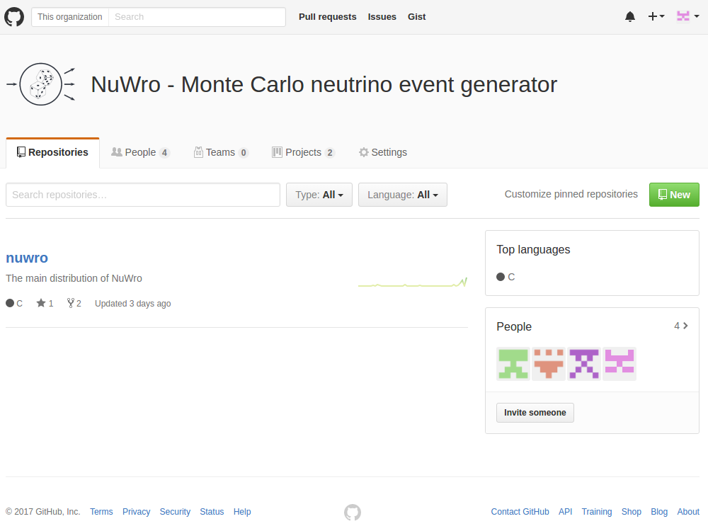

% NuWro: announcement
% T. Golan
% NIWG, 06-07.02.2017

#

## New repository

---

[https://github.com/NuWro](https://github.com/NuWro)



## New releases scheme

---

[https://github.com/NuWro/nuwro/releases](https://github.com/NuWro/nuwro/releases)


<div class="right">

* one can check version from command line

```
$ ./bin/nuwro -v
nuwro_17.01-27-g0563b32
```

* or from output ROOT file in TNamed("Nuwro version")

```
root [0] TFile* f = new TFile("out.root")
root [1] f->Get("NuWro version")->GetTitle()
(const char *) "nuwro_17.01-30-gfd20ebd"
```

* taken from *git described* in Makefile

</div>

## New wiki

---

[https://github.com/NuWro/nuwro/wiki](https://github.com/NuWro/nuwro/wiki)


## New physics

---

coming soon