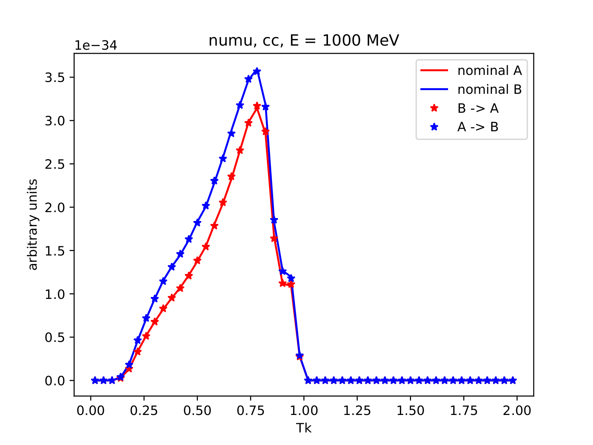
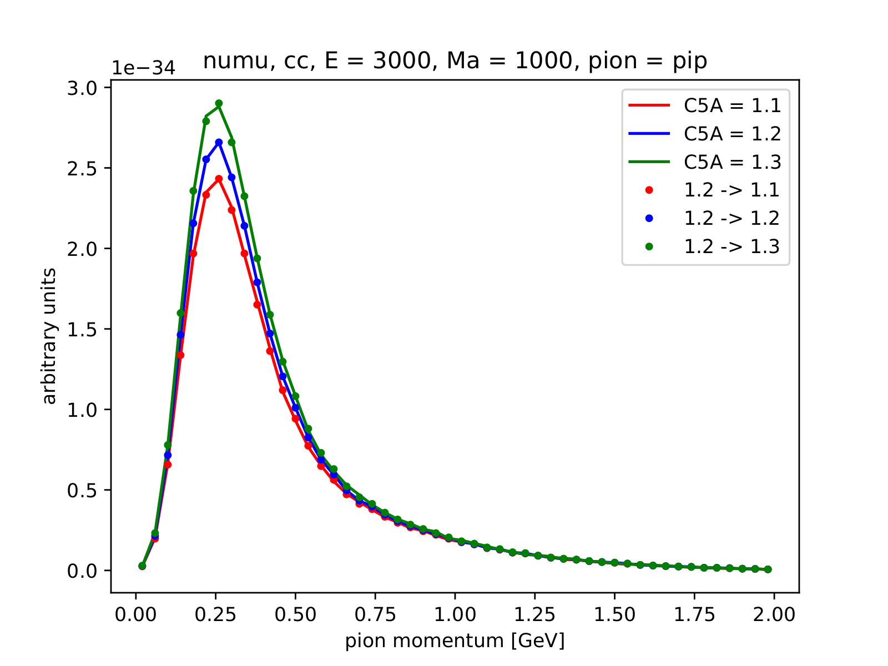
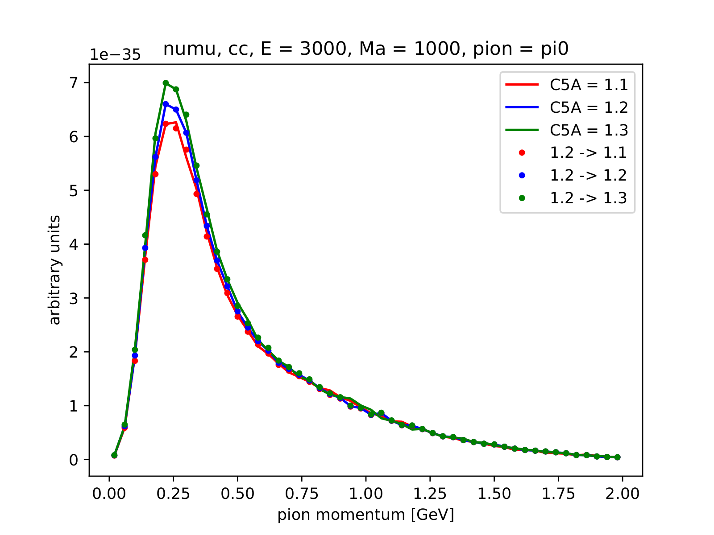

% NuWro Reweighting
% Tomasz Golan
% NIWG, 06.02.18

<div class='footer'>
Navigate:
<br> &emsp; PgDn / PgUp - next / previous slide
<br> &emsp; Space / Shift+Space - next / previous slide
<br> &emsp; Esc - expo mode
</div>

## Basics

---

* ongoing project

* based on Luke Pickering and Patrick Stowell work

* reweighting framework created by Cezary Juszczak

* QEL is done (CJ)

* RES in progress (TG)

* available in reweighting branch

## Usage and output

---

<div class="left">

* There are two output files:

    * ROOT file with events tree with new weights
    * ROOT file with weights only

* One can disable unwanted output

</div>
<div class="right"><br>
```
reweight_to <nuwro_output.root> \
            -p param1 val1 \
            -p param2 val2 \
            -p param3 val3 \
            ...
            [-o <weighted_events.root>] \
            [--no_weights] [--no_events] 
```
</div>

## QEL knobs

---

For quasi-elastic scattering the following knobs are available:

* `qel_cc_axial_mass`

* `qel_nc_axial_mass`

* `qel_s_axial_mass`

* `delta_s`

## QEL Test

---

<div class="left">

Simulation A:

```
-p "qel_cc_axial_mass = 1000" \
-p "qel_nc_axial_mass = 1000" \
-p "qel_s_axial_mass = 1000" \
-p "delta_s = 0"
```

Simulation B:

```
-p "qel_cc_axial_mass = 1200" \
-p "qel_nc_axial_mass = 1200" \
-p "qel_s_axial_mass = 1200" \
-p "delta_s = -0.2"
```

</div>


## QEL Test II

---




## RES Knobs

---

For resonance pion production the following knobs are available:

* `pion_axial_mass`

* `pion_C5A`

## RES Test C5A

---




## RES Test Axial Mass

---


## Summary

---

* Finishing of reweighting is one of our priorities

* QEL - done, RES - almost done

* Next seps:

    * add more parameters

    * add reweighting for FSI