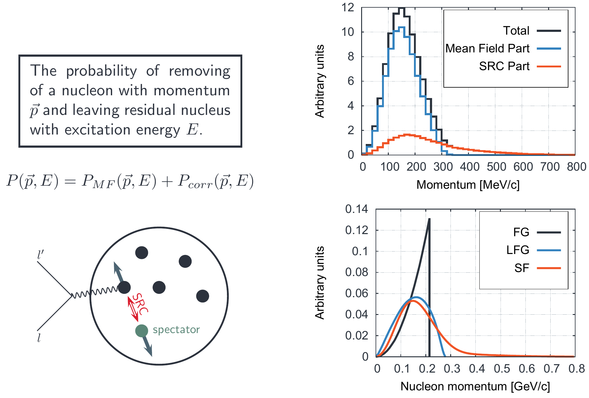
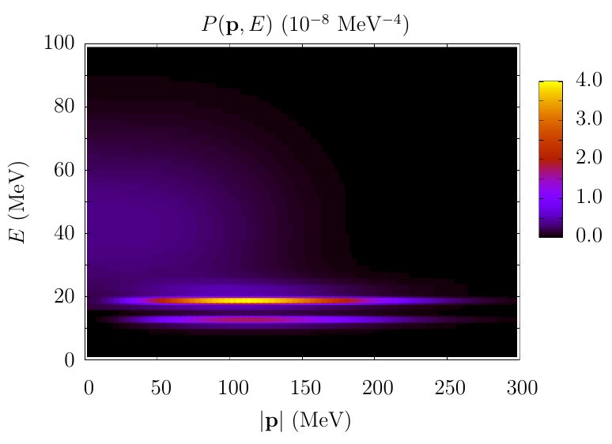
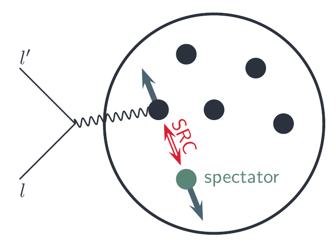
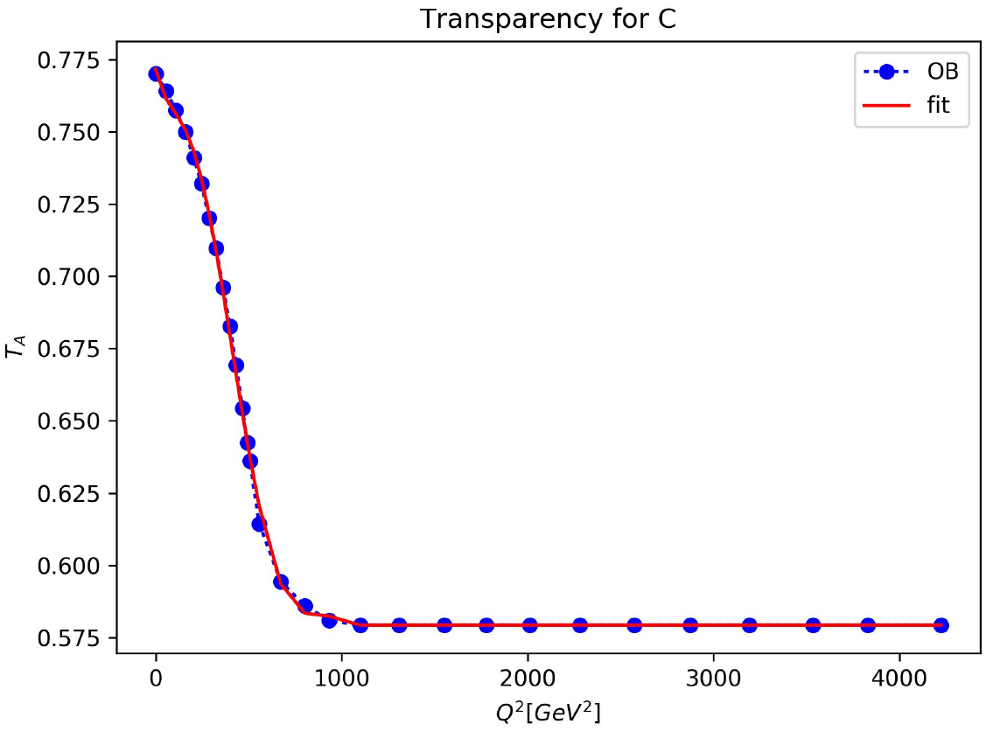
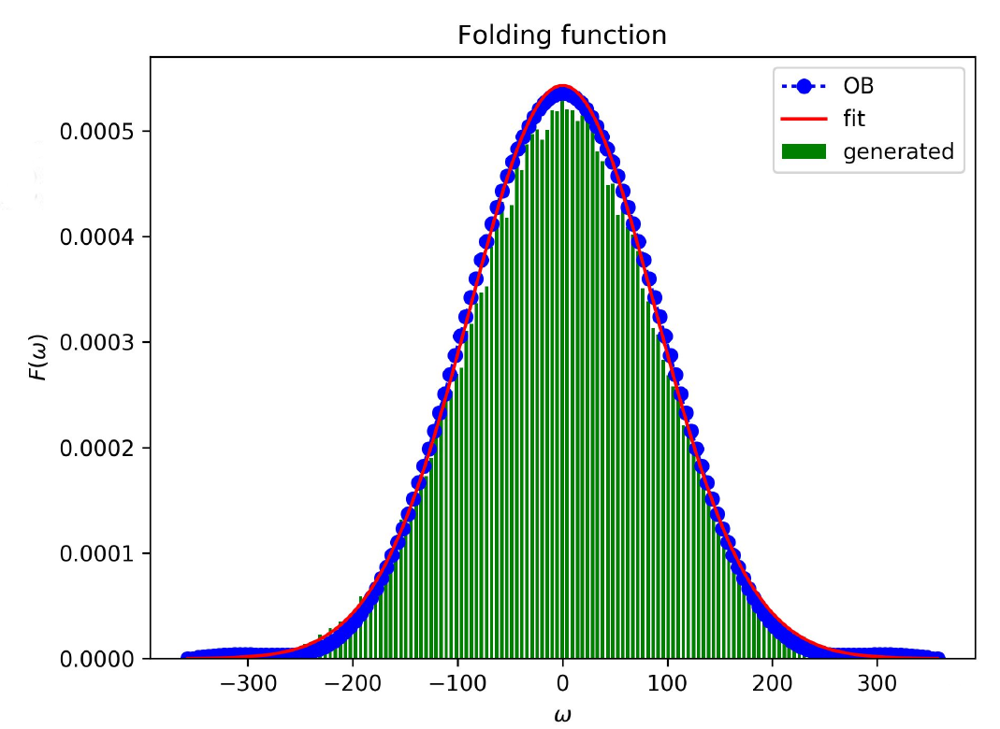
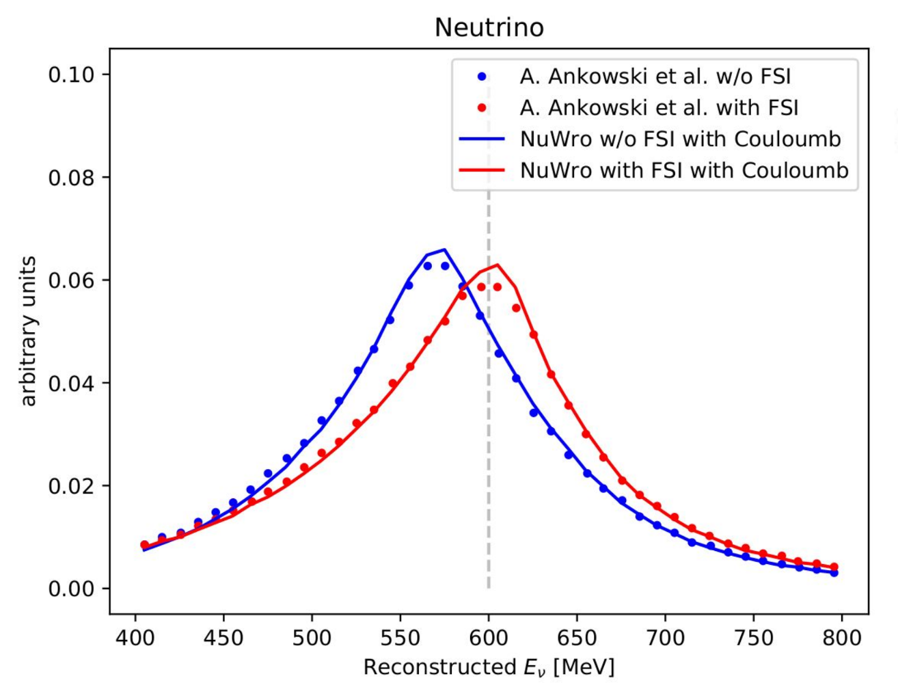

% Spectral function in NuWro
% Tomasz Golan (on behalf of NuWro Collaboration)
% 03-05.12.2017, NuWro Workshop 2017

Navigate:
  &emsp; PgDn / PgUp - next / previous slide
  &emsp; Space / Shift+Space - next / previous slide
  &emsp; Esc - expo mode

#

## Spectral Function

---

 

*The probability of removing a nucleon with momentum $\vec p$ and leaving residual nucleus with excitation energy $E$.*

\begin{eqnarray}
& & P(\vec p, E) = \\
& & \sum\limits_n \left|\left<\psi_n^{A-1}|a_p|\psi_0^A\right>\right|^2\delta(E + E_0 - E_n)
\end{eqnarray}

*O. Benhar et al. PRD72 (2005) 053005*

## Spectral Function Begins

---

* Artur Ankowski PhD Thesis ([in Polish](http://neutrino.ift.uni.wroc.pl/files/Ankowski_PhD.pdf)) - collaboration with O. Benhar

* in NuWro spectral function for:

    * carbon
    * oxygen 
    * iron
    * (approximated) calcium
    * (approximated) argon

## 

#

## Implementation

## Starting point

---

* differential cross section (in impulse approximation)    $$d\sigma = x \int dE d^3p P(\vec p, E) \int d^3k' \delta(E_{k'} + E_{p'} - y)\frac{L_{\mu\nu}H^{\mu\nu}}{E_p E_{k'} E_{p'}}$$  

    * $x = \frac{G_F^2\cos^2\theta_C}{8\pi^2E_k}$
    * $y = E_k + M - E$ (constant for fixed $E$ and $\vec p$)

## Momentum and removal energy

---

  

* momentum ($\vec p$) and removal energy ($E$) are chosen randomly according to $P(\vec p, E)$

* integral over $d^3k'$ is performed for fixed $\vec p$ and $E$

*src: A. Ankowski thesis*

## Integral over final lepton kinematics

---

* having $\vec p$ and $E$ fixed final lepton kinematics is calculated in CMS frame

* this approach is much faster than the original implementation

* with good numerical stability

* and the result are the same

#

## Spectator

---

* if an interaction happens on correlated nucleon we assume a spectator to have momentum $-\vec p$

* *educated guess* method is used to determine if this is a case

#

## Coulomb corrections

## Coulomb correction to SF

---

* protons repel each other (smaller binding energy)

* protons **energy levels** are measured

* for **neutrons** one need to apply Coulomb correction    $$P_{hole}^n (\vec p, E) = P_{hole}^{p}(\vec p, E - \Delta)$$  

* $\Delta = 2.8$ MeV (for Carbon, *src: A. Ankowski, PRC86 (2012) 024616*)

* affects *NC* and neutrino *CC*

## Charged lepton and Coulomb potential

---

* Coulomb potential decrease (increase) energy of negative (positive) charged particles (leaving nucleus)

* assuming constant shift $\Delta = 3.5$ MeV (for Carbon, *src: A. Ankowski et al., PRD91 (2015) 03305*)

* affects *CC* (opposite sign for neutrino and anti-neutrino)

#

## Final state interactions

## From IA to FSI

---

* knock-out nucleon interacts with spectators, which modifies energy transfer    $$\frac{d\sigma^{FSI}}{d\omega d\Omega} = \int d\omega' f_{\vec q}(\omega - \omega') \frac{d\sigma^{IA}}{d\omega' d\Omega}$$  

* note: fixed angle

* $f_{\vec q}$ - folding function

## Folding function

---

   $$f_{\vec q} (\omega) = \delta(\omega)\sqrt{T_A} + (1 - \sqrt{T_A})F_{\vec q}(\omega)$$  

* $T_A$ - nuclear transparency
* $F_{\vec q}(\omega) = \frac{1}{\pi}\frac{U_W}{U_W^2 + \omega^2}$
* $U_W$ is the imaginary part of the potential ($U = U_V + iU_W$)
* Real part of the potential shifts the energy transfer

$$f_{\vec q}(\omega - \omega') \rightarrow f_{\vec q}(\omega - \omega' - U_V)$$

## Nuclear transparency

---

  

* note: $\sqrt{T_A} > 0.75$    $$f_{\vec q} (\omega) = \delta(\omega)\sqrt{T_A} + (1 - \sqrt{T_A})F_{\vec q}(\omega)$$  

* imaginary part of the potential does not have much impact

*O. Benhar et al., PRD72 (2005) 053005*

## Folding function

---

  

* calculated for fixed $\vec q = 1$ GeV

* it smears energy transfer distribution

* in NuWro implementation Gauss fit is used

*O. Benhar, PRC87 (2013) 024606*

## Real part of the potential

---

 

* $U_V$ shifts the energy transfer distribution

* $U_W$ smears the energy transfer distribution with the probability $(1 - \sqrt{T_A})$

* both $U_V$ and $T$ depends on the final nucleon kinetic energy

*A. Ankowski et al., PRD91 (2015) 033005*

## Final nucleon energy

---

   $$\frac{d\sigma^{FSI}}{d\omega d\Omega} = \int d\omega' f_{\vec q}(\omega - \omega') \frac{d\sigma^{IA}}{d\omega' d\Omega}$$  

* to calculate this integral for fixed scattering angle the following approximation is used for final nucleon kinetic energy

$$T_k = \frac{E_k^2 \cdot (1 - \cos\theta)}{M + E_k \cdot (1 - \cos\theta)}$$

## MC Procedure

---

  $$\frac{d\sigma^{FSI}}{d\omega d\Omega} = \int d\omega' f_{\vec q}(\omega - \omega') \frac{d\sigma^{IA}}{d\omega' d\Omega}$$  

* calculate $\frac{d\sigma^{IA}}{d\omega' d\Omega}$

* calculate $T_k$ of final nucleon, and then $U_V$ and $T_A$

* if `rand[0,1]` > $\sqrt{T_A}$: $\omega = \omega' + U_V$

* else $\omega = \omega' + U_V + x$, where $x$ is random from $F_{\vec q}(\omega)$

#

## Reconstructed energy

## Procedure

---

* original results from *A. Ankowski et al., PRD91 (2015) 033005* (include FSI and Coulomb corrections)

* reconstructed energy formula (nucleon at rest)    $$E_\nu = \frac{2E_l\tilde M - m^2 + \tilde M^2 - M^2}{2(\tilde M - E_l + |\vec k_l|\cos\theta)}$$  

* $\tilde M = M - \varepsilon$

* $\varepsilon = 19$ MeV for neutrino, $\varepsilon = 6$ MeV for anti-neutrino 

## Comparison

---

## Coulomb on/off

---

#

## Summary

---

* The implementation of spectral function in NuWro

    * is super fast

    * includes spectator knock-out

    * includes Coulomb correction (for Carbon)

    * includes FSI effects (for Carbon)

* Approximated SF for Argon can be used (before the "real one" becomes available)