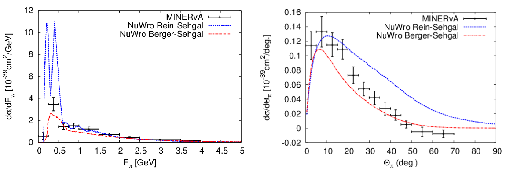
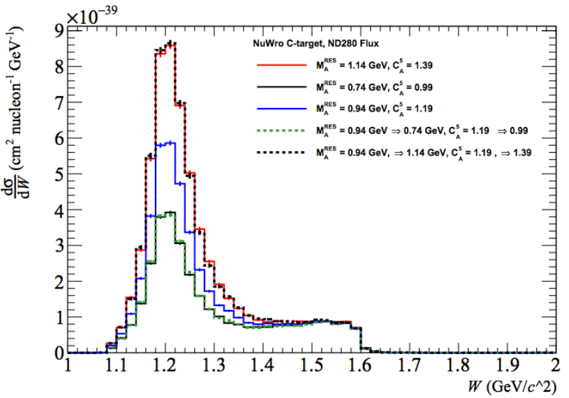
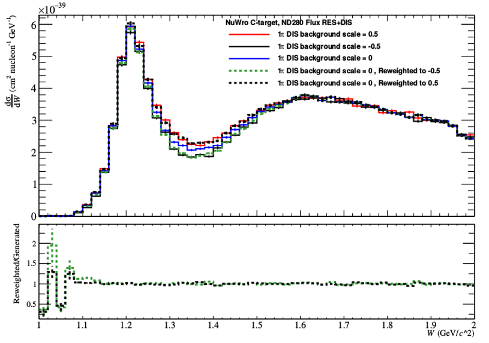
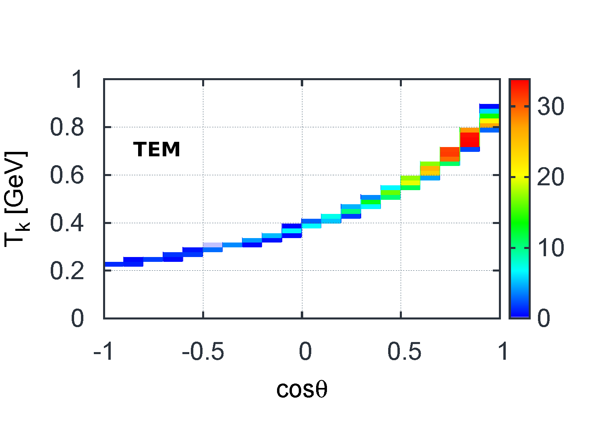
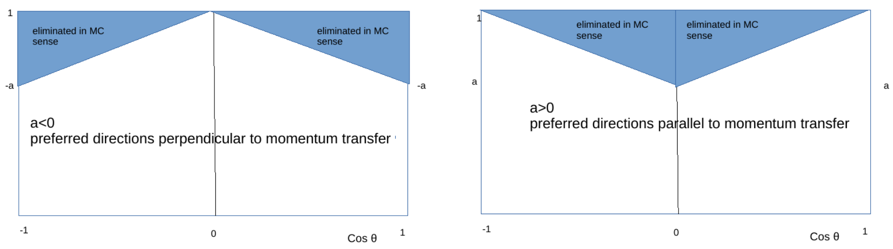
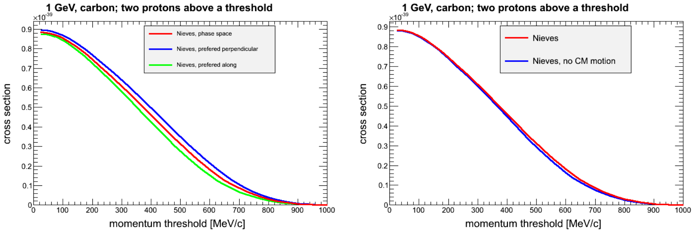

% NuWro Update
% Tomasz Golan
% *On behalf of Generator Group* <br> <br> MINERvA Week June 2016

### Recent developments

---

* Berger-Sehgal for coherent pion production

* Effective momentum and density dependent potential

* Non-resonant background scaling

* Reweighting tools

* Hadronic states for 2p2h

* eWro

---

### Berger-Sehgal

---



* some old NuWro samples were made with RS model, but now BS is default and
will be used if not specified in a request

---

### Effective potential

---

<div class="left">
<br>Binding energy depends on both nucleons momentum and location.
</div>
<div class="right">

</div>

* initial momentum random from Fermi sphere (assuming local Fermi gas)

* outgoing momentum random in CMS; Pauli blocking included (in LAB)

* in current implementation final nucleon is not affected by FSI

* final momentum adjusted according to: $E \rightarrow E + V$
(or nucleus in excited state if nucleon unable to leave)

---

### Non-resonant background

---

<div class="right">
Transition region in NuWro:

</div>
<div class="left"><br>

* There is a new parameter in params.txt: bkgrscaling

* Control non-resonant background contribution to SPP

<br>
</div>

---

### NuWro reweighting

---

* Reweighting tools developed by Luke Pickering (Imperial College London) and Patrick Stowell (University of Sheffield)

<div class="left"><br>

```cpp
   Nuwro_MaCCQE         Nuwro_BBBA07
   Nuwro_NormQEL        Nuwro_NormRES
   Nuwro_NormDIS        Nuwro_NormCOH
   Nuwro_NormMEC        Nuwro_NormDYN
   Nuwro_MaRES          Nuwro_Ca5
   Nuwro_Ma_NCEL        Nuwro_Ma_NCEL_s
   Nuwro_DeltaS
```

<br>

*All reweighting plots courtesy of Luke and Patrick*

</div>


---

### RES/DIS reweighting

---





---

### FSI reweighting

---

* Luke and Patrick also started to work on **FSI reweighting**

> Start by doing what's necessary; then do what's possible; and suddenly you are doing the impossible.
>
<div style="text-align:right;">Francis of Assisi</div>

---

### 2p2h contribution

---

<div class="left">

Two sources of 2p2h final states:

* spectral function in (one body) QE dynamics

* two-body current interactions

    * Transverse Enhancement Model (TEM) by A. Bodek et al.

    * Nieves et al. model

</div>
<div class="right">


</div>

---

### Two-body current

---

<div class="left">

*Only lepton kinematics*


</div>
<div class="right">


</div>

---

### 2p2h: open questions

---

<div class="left"><br>

* interaction point *(see plot)*

* isospin *(pn more likely)*

* initial momenta

* final momenta

</div>

<div class="right">


*(blue $\rightarrow r^2\rho$, red $\rightarrow r^2\rho^2$)*

</div>

---

### 2p2h: initial momenta

---

* two nucleons in back-to-back configuration

* momentum distribution includes large momentum tail (taken from SF)

* CM motion (gaussian distribution)

* or no CM motion and mec_back_to_back_smearing

---

### 2p2h: final momenta

---

* uniform in CMS

* or prefer some direction respect to $\vec q$




---

### CC no pion events

---



---

### eWro

---

<div class="left"><br>

* electron-nucleus interactions to test nuclear models in NuWro

* not really straightforward as total electron cross section is $\infty$...

</div>
<div class="right">

<br>
</div>

---

# THE END
