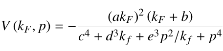

% NuWro Update
% Tomasz Golan
% *On behalf of Generator Group*     MINERvA Week June 2016

### Recent developments

---

* Berger-Sehgal for coherent pion production

* Non-resonant background scaling

* Reweighting tools

* Effective momentum and density dependent potential

* Hadronic states for 2p2h

* eWro

---

### Berger-Sehgal

---

* some old NuWro samples were made with RS model, but now BS is default and
will be used if not specified in a request

---

### Non-resonant background

---

Transition region in NuWro:

 

* There is a new parameter in params.txt: bkgrscaling

* It can be used to scale non-resonant background (by modifying $\alpha$)

 

---

### FSI reweighting

---

> Start by doing what's necessary; then do what's possible; and suddenly you are doing the impossible.
>

Francis of Assisi

---

* FSI reweighting tool for NuWro by Patrick Stowell and Luke Pickering

* Status: work in progress

---

### Effective potential

---

 Binding energy depends on both nucleons momentum and location.

* initial momentum random from Fermi sphere (assuming local Fermi gas)

* outgoing momentum random in CMS; Pauli blocking included (in LAB)

* in current implementation final nucleon is not affected by FSI

* final momentum adjusted according to: $E \rightarrow E + V$
(or nucleus in excited state if nucleon unable to leave)

---

### 2p2h contribution

---

There are two source of 2p2h final states:

* spectral function in (one body) QE dynamics

* two-body current interactions

    * TEM

    * Nieves

[tbc]

---

### eWro

---

 

* electron-nucleus interactions to test nuclear models in NuWro

* not really straightforward as total electron cross section is $\infty$...

 

---
