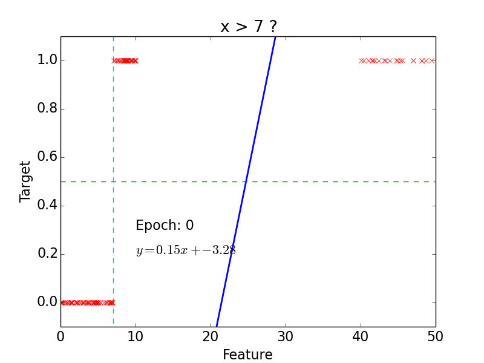
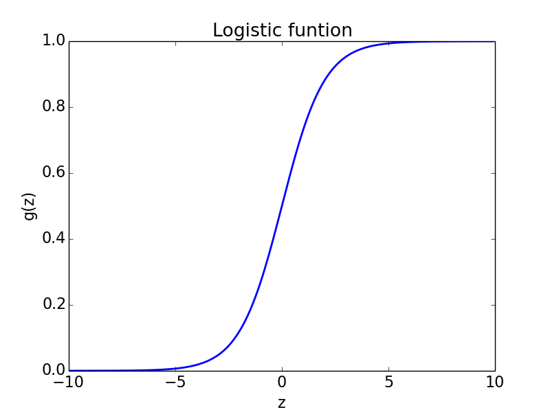
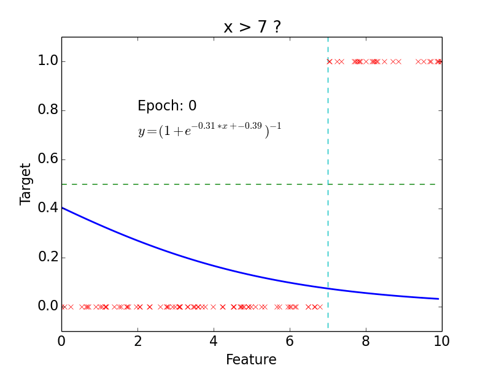
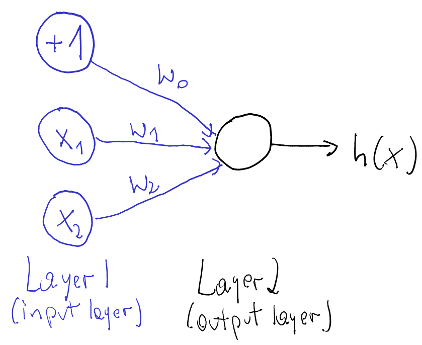
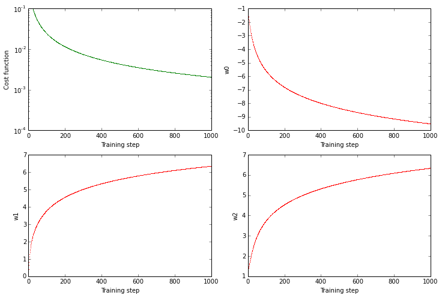
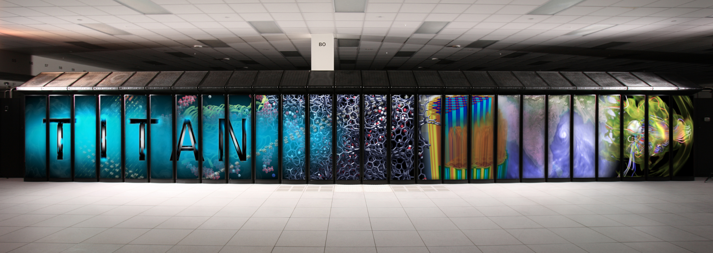

% Update on MLVF
% Tomasz Golan
% Rochester meeting, 04.18.2016

# Outline

- [Introduction](#linear-regression)
    - [Linear Regression](#linear-regression)
    - [Logistic Regression](#logistic-regression)
    - [Neural Networks](#neural-networks)
    - [Convolutional Neural Networks](#convolutional-neural-networks)
- [MLVF (Machine Learning Vertex Finding) progress](#mlvf-progress)
- [Oak Ridge National Laboratory](#oak-ridge-national-laboratory)

#

## Linear Regression

## Notation

---

* Hypothesis (for convenience $x_0 = 1$):
$$h(x) = w_0 + w_1x_1 + ... + w_nx_n = \sum\limits_{i=0}^n w_i x_i = w^T x$$
* Cost function:
$$f(w) = \frac{1}{2}\sum\limits_{i=0}^n\left(h (x^{(i)}) - y^{(i)}\right)^2$$
* Learning step (gradient descent, $\alpha$ - training rate):
$$w_j = w_j - \alpha\frac{\partial f(w)}{\partial w_j} = w_j + \alpha\sum\limits_{i=0}^n\left(y^{(i)} - h (x^{(i)})\right)x_j$$

## Example

---

 

- **epoch** = one loop over the whole training sample

- for each feature vector weights are updated using **gradient descent** method

## Classification

---

 

- target: $y = 0, 1$

- not really efficient for classification

- imagine having some data ~ 100

- logistic function does better job

## Classification

---

#

## Logistic Regression

## Logistic function

---

 

* Logistic function:
$$g(z) = \frac{1}{1 + e^{-z}}$$

* Hypothesis:
$$h(x) = g(w^Tx) = \frac{1}{1 + e^{-w^Tx}}$$

## Classification

---

* Probability of 1:
$$P (y = 1 | x, w) = h(x)$$

* Probability of 0:
$$P (y = 0 | x, w) = 1 - h(x)$$

* Probability:
$$p (y | x, w) = (h(x))^y\cdot(1 - h(x))^{1 - y}$$

##

* Likelihood:
$$L(w) = \prod\limits_{i=0}^n p(y^{(i)} | x^{(i)}, w) = \prod\limits_{i=0}^n (h(x^{(i)}))^{y^{(i)}}\cdot(1 - h(x^{(i)}))^{1 - y^{(i)}}$$

* Log-likelihood:
$$l(w) = \log L(w) = \sum\limits_{i=0}^n y^{(i)}\log h(x^{(i)}) + (1 - y^{(i)})\log (1-h(x^{(i)}))$$

* Learning step (maximize $l(w)$):
$$w_j = w_j + \alpha\frac{\partial l(w)}{\partial w_j} = w_j + \alpha\sum\limits_{i=0}^n\left(y^{(i)} - h (x^{(i)})\right)x_j$$

## Results

---

## Why do we need neural networks?

---

- We can do classification

- We can do regression

- But real problems are nonlinear

## Non-linear problem

---

## Cheat

---

* Feature vector:
$$(x,y) \rightarrow (x,y,x^2,y^2)$$

* Hypothesis:
$$h (x) = \frac{1}{1 + e^{-w_0 - w_1x - w_2y - w_3x^2 - w_4y^2}}$$

*In general, adding extra dimension by hand would be hard / impossible.
Neural networks do that for us.*

#

## Neural Networks

## Neuron

---

 

- neuron = activation function:
    - linear
    - binary step
    - logistic
    - tanh
    - relu
    - ...

## AND gate

---

| | | | | |
|:---:|:---:|:---:|:---:|:---:|
| $x_1$ | 0 | 1 | 0 | 1 |
| $x_2$ | 0 | 0 | 1 | 1 |
| AND | 0 | 0 | 0 | 1 |

 

- Hypothesis = logistic function:

$$h(x) = \frac{1}{1 + e^{-w^Tx}}$$

---

Intuition:

- $w_0 < 0$
- $w_0 + w_1 < 0$
- $w_0 + w_2 < 0$
- $w_0 + w_1 + w_2 > 0$

## AND gate - learning

---

## Non-linear problem: XOR gate

---

## Neural network for XOR

---

> x XOR y = (x AND NOT y) OR (y AND NOT x)

#

## Convolutional Neural Networks

## Idea

---

## Convolution

---

src: [deeplearning.net](http://deeplearning.stanford.edu/wiki/images/6/6c/Convolution_schematic.gif)

## "Clones" of a neuron looking at different part of an image

---

## Convolution Layer

---

*No. of convolved feature vectors / matrices = No. of filters*

## Pooling

---

src: [wildml.com](http://www.wildml.com/2015/11/understanding-convolutional-neural-networks-for-nlp/)

## Pooling - example

---

src: [arxiv](http://arxiv.org/abs/1506.03767)

## CNN example

---

src: [wildml.com](http://www.wildml.com/2015/11/understanding-convolutional-neural-networks-for-nlp/)

#

## MLVF Progress

## What are we looking for?

---

- The first goal is to use CNN to find vertex in nuclear target region

      - **Classification**: upstream of target 1, target 1, plastic between target 1 and target 2, target 2...

      - **Regression**: in progress, no luck so far

- Apply this for Marianette's DIS measurement

- Next steps: NC$\pi^0$? $\pi$ momentum? hadron multiplicities?

## What are we looking at?

---

 

- started with smaller samples to save GPU time and memory usage

- working on "z-extension"

## Classification regions

---

## Learning and testing samples

---

- At this point we use **me1B** to **train** the net

- and **me1A** to **test** the net

---

<h2> Frameworks in use </h2>

---

- [**Theano**](http://deeplearning.net/software/theano/) - Python library for numerical computation
- [**Lasagne**](https://github.com/Lasagne/Lasagne) - Python library to build and train neural networks in Theano
- [**Fuel**](https://github.com/mila-udem/fuel) - data management

## Most promising CNN so far

---

| | | |
|:---:|:---:|:---:|:---:|
| **Convolution layer** | **No. of filters** | **Filter size** | **Pool size** |
| 1 | 12 | (8,3) | (2,1) |
| 2 | 20 | (7,3) | (2,1) |
| 3 | 28 | (6,3) | (2,1) |
| 4 | 36 | (6,3) | (2,1) |

---

- and fully connected layers at the end of net

##

## CNN in analysis... coming soon

#

## Oak Ridge National Laboratory

## Titan

---

- We have been working on Wilson Cluster, which has... 2 GPUs
- Recently, we got $10^6$ GPU hours on Titan

---

src: [olcf.ornl.gov](https://www.olcf.ornl.gov/media-center/image-gallery/)

## 2nd on TOP500 list

---

src: [wikpedia](https://en.wikipedia.org/wiki/TOP500)

## Yes, it has more than 2 GPUs

---

> *it has **18,668** NVIDIA Kepler GPUs*

---

## Summary

---

- when presentation is done
